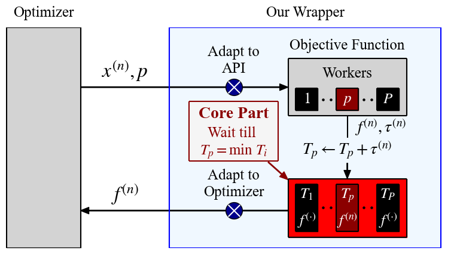
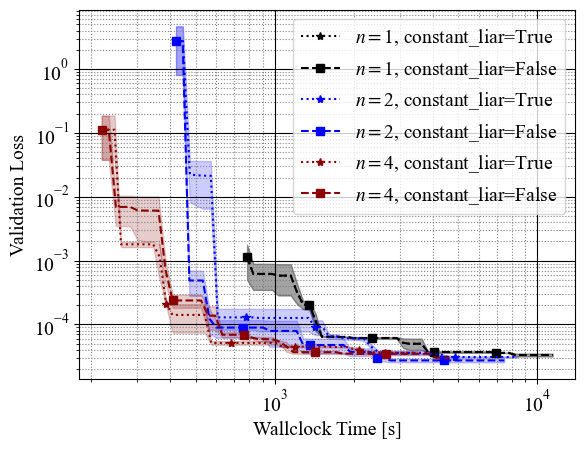

## Abstract

When running parallel optimization experiments using tabular or surrogate benchmarks, each evaluation must be ordered based on the runtime that each configuration would take in reality.
However, the evaluation of tabular or surrogate benchmarks, by design, does not take long.
For this reason, the timing of each configuration must be ordered as if we actually evaluated each configuration.

This package provides a simulator that automatically handles this problem by internally managing the order of hyperparameter configuration evaluations.
Users can pass the optimizer to the simulator directly, and it automatically performs the optimization loop as if function calls are run in parallel -- all without any actual waiting.

This package is adapted for OptunaHub based on [the original implementation](https://github.com/nabenabe0928/mfhpo-simulator).



To see a concrete example, see [benchmarking_example.py](https://github.com/optuna/optunahub-registry/tree/main/package/benchmarks/async_opt_simulator/benchmarking_example.py).
This example generates the following:



## APIs

### `AsyncOptBenchmarkSimulator(n_workers: int, allow_parallel_sampling: bool = False)`

- `n_workers`: The number of simulated workers. In other words, how many parallel workers to simulate.
- `allow_parallel_sampling`: Whether sampling can happen in parallel. If `True`, an imprecise simulation is used and results may not accurately reflect the behavior of expensive samplers.

### `AsyncOptBenchmarkSimulator.optimize(study: optuna.Study, problem: BaseProblem, runtime_func: RuntimeFunc, *, n_trials: int | None = None, timeout: float | None = None) -> None`

- `study`: An Optuna study object.
- `problem`: A benchmark problem that implements the `BaseProblem` interface from `optunahub.benchmarks`.
- `runtime_func`: A callable that takes an `optuna.Trial` and returns the simulated runtime (float) for that trial.
- `n_trials`: How many trials to collect.
- `timeout`: The maximum total evaluation time for the optimization (in simulated time, not actual runtime).

### `AsyncOptBenchmarkSimulator.get_results_from_study(study: optuna.Study, states: TrialState | None = None) -> dict[str, list]` (static method)

- `study`: An Optuna study object.
- `states`: Trial states to include. Defaults to `(TrialState.COMPLETE, TrialState.PRUNED)`. Cannot contain states other than `COMPLETE` and `PRUNED`.
- Returns a dictionary with keys `"cumtime"`, `"values"`, and `"worker_id"`.

## Example

```python
import optuna
import optunahub


AsyncOptBenchmarkSimulator = optunahub.load_module("benchmarks/async_opt_simulator").AsyncOptBenchmarkSimulator
sim = AsyncOptBenchmarkSimulator(n_workers=4)
Problem = optunahub.load_module("benchmarks/hpolib").Problem
problem = Problem(dataset_id=0, metric_names=["val_loss"])
runtime_func = Problem(dataset_id=0, metric_names=["train_time"])
study = optuna.create_study(directions=problem.directions)
sim.optimize(study=study, problem=problem, runtime_func=runtime_func=lambda t: runtime_func(t)[0], n_trials=100)
print(sim.get_results_from_study(study))
```

Unit tests are also available for this package:

```shell
# Additional dependency.
$ pip install mfhpo-benchmark-api pytest
# Run the unit tests.
$ pytest package/benchmarks/async_opt_simulator/tests
```

### Bibtex

```bibtex
@article{watanabe2023mfo-simulator,
  title   = {{P}ython Wrapper for Simulating Multi-Fidelity Optimization on {HPO} Benchmarks without Any Wait},
  author  = {S. Watanabe},
  journal = {arXiv:2305.17595},
  year    = {2023},
}
```

```bibtex
@article{watanabe2024mfo-simulator,
  title   = {Fast Benchmarking of Asynchronous Multi-Fidelity Optimization on Zero-Cost Benchmarks},
  author  = {S. Watanabe, N. Mallik, E. Bergman, F. Hutter},
  journal = {arXiv:2403.01888},
  year    = {2024},
}
```
