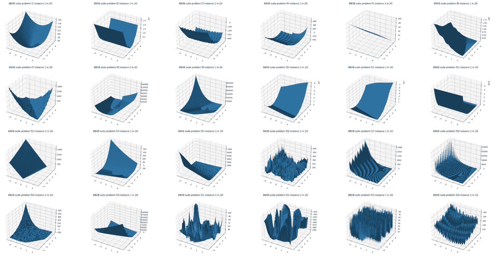

## Abstract

The blackbox optimization benchmarking (bbob) test suite comprises 24 noiseless single-objective test functions. BBOB is one of the most widely used test suites to evaluate and compare the performance of blackbox optimization algorithms. Each benchmark function is provided in dimensions \[2, 3, 5, 10, 20, 40\] with 110 instances.

## APIs

### class `Problem(function_id: int, dimension: int, instance_id: int = 1)`

- `function_id`: [ID of the bbob benchmark function](https://numbbo.github.io/coco/testsuites/bbob) to use. It must be in the range of `[1, 24]`.
- `dimension`: Dimension of the benchmark function. It must be in `[2, 3, 5, 10, 20, 40]`.
- `instance_id`: ID of the instance of the benchmark function. It must be in the range of `[1, 110]`.

#### Methods and Properties

- `search_space`: Return the search space.
  - Returns: `dict[str, optuna.distributions.BaseDistribution]`
- `directions`: Return the optimization directions.
  - Returns: `list[optuna.study.StudyDirection]`
- `__call__(trial: optuna.Trial)`: Evaluate the objective function and return the objective value.
  - Args:
    - `trial`: Optuna trial object.
  - Returns: `float`
- `evaluate(params: dict[str, float])`: Evaluate the objective function given a dictionary of parameters.
  - Args:
    - `params`: Decision variable like `{"x0": x1_value, "x1": x1_value, ..., "xn": xn_value}`. The number of parameters must be equal to `dimension`.
  - Returns: `float`

The properties defined by [cocoex.Problem](https://numbbo.github.io/coco-doc/apidocs/cocoex/cocoex.Problem.html) are also available such as `number_of_objectives`.

## Installation

Please install the [coco-experiment](https://github.com/numbbo/coco-experiment/tree/main/build/python) package.

```shell
pip install -U coco-experiment
```

## Example

```python
import optuna
import optunahub


bbob = optunahub.load_module("benchmarks/bbob")
sphere2d = bbob.Problem(function_id=1, dimension=2, instance_id=1)

study = optuna.create_study(directions=sphere2d.directions)
study.optimize(sphere2d, n_trials=20)

print(study.best_trial.params, study.best_trial.value)
```

## List of Benchmark Functions

Please refer to [the paper](https://numbbo.github.io/gforge/downloads/download16.00/bbobdocfunctions.pdf) for details about each benchmark function.

**Category**

1. Separable Functions
1. Functions with low or moderate conditioning
1. Functions with high conditioning and unimodal
1. Multi-modal functions with adequate global structure
1. Multi-modal functions with weak global structure

| Category  | Function ID | Function Name                                                                                                            |
|-----------|-------------|--------------------------------------------------------------------------------------------------------------------------|
| 1         | 1           | [Sphere Function](https://coco-platform.org/testsuites/bbob/functions/f01.html)                                          |
| 1         | 2           | [Separable Ellipsoidal Function](https://coco-platform.org/testsuites/bbob/functions/f02.html)                           |
| 1         | 3           | [Rastrigin Function](https://coco-platform.org/testsuites/bbob/functions/f03.html)                                       |
| 1         | 4           | [Büche-Rastrigin Function](https://coco-platform.org/testsuites/bbob/functions/f04.html)                                 |
| 1         | 5           | [Linear Slope](https://coco-platform.org/testsuites/bbob/functions/f05.html)                                             |
| 2         | 6           | [Attractive Sector Function](https://coco-platform.org/testsuites/bbob/functions/f06.html)                               |
| 2         | 7           | [Step Ellipsoidal Function](https://coco-platform.org/testsuites/bbob/functions/f07.html)                                |
| 2         | 8           | [Rosenbrock Function, original](https://coco-platform.org/testsuites/bbob/functions/f08.html)                            |
| 2         | 9           | [Rosenbrock Function, rotated](https://coco-platform.org/testsuites/bbob/functions/f09.html)                             |
| 3         | 10          | [Ellipsoidal Function](https://coco-platform.org/testsuites/bbob/functions/f10.html)                                     |
| 3         | 11          | [Discus Function](https://coco-platform.org/testsuites/bbob/functions/f11.html)                                          |
| 3         | 12          | [Bent Cigar Function](https://coco-platform.org/testsuites/bbob/functions/f12.html)                                      |
| 3         | 13          | [Sharp Ridge Function](https://coco-platform.org/testsuites/bbob/functions/f13.html)                                     |
| 3         | 14          | [Different Powers Function](https://coco-platform.org/testsuites/bbob/functions/f14.html)                                |
| 4         | 15          | [Rastrigin Function](https://coco-platform.org/testsuites/bbob/functions/f15.html)                                       |
| 4         | 16          | [Weierstrass Function](https://coco-platform.org/testsuites/bbob/functions/f16.html)                                     |
| 4         | 17          | [Schaffer's F7 Function](https://coco-platform.org/testsuites/bbob/functions/f17.html)                                   |
| 4         | 18          | [Schaffer's F7 Function, moderately ill-conditioned](https://coco-platform.org/testsuites/bbob/functions/f18.html)       |
| 4         | 19          | [Composite Griewank-Rosenbrock Function F8F2](https://coco-platform.org/testsuites/bbob/functions/f19.html)              |
| 5         | 20          | [Schwefel Function](https://coco-platform.org/testsuites/bbob/functions/f20.html)                                        |
| 5         | 21          | [Gallagher's Gaussian 101-me Peaks Function](https://coco-platform.org/testsuites/bbob/functions/f21.html)               |
| 5         | 22          | [Gallagher's Gaussian 21-hi Peaks Function](https://coco-platform.org/testsuites/bbob/functions/f22.html)                |
| 5         | 23          | [Katsuura Function](https://coco-platform.org/testsuites/bbob/functions/f23.html)                                        |
| 5         | 24          | [Lunacek bi-Rastrigin Function](https://coco-platform.org/testsuites/bbob/functions/f24.html)                            |



## Reference

Finck, S., Hansen, N., Ros, R., & Auger, A. [Real-Parameter Black-Box Optimization Benchmarking 2010: Presentation of the Noiseless Functions](https://numbbo.github.io/gforge/downloads/download16.00/bbobdocfunctions.pdf).
