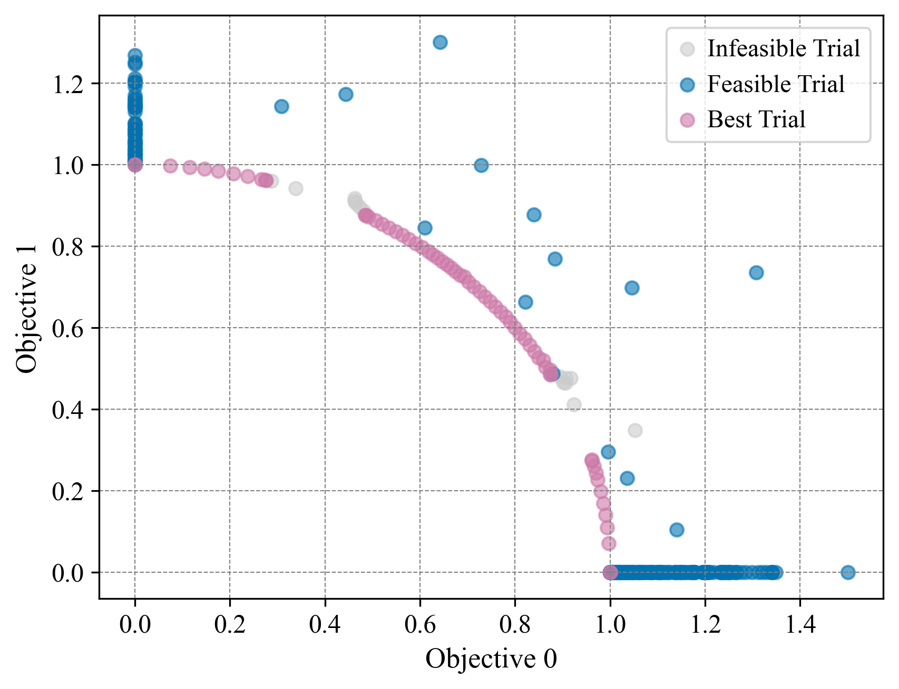

## Abstract

This package provides test suites for the C-DTLZ problems (Jain & Deb, 2014), a constrained version of the DTLZ problems (Deb et al., 2001).
The DTLZ problems are a set of continuous multi-objective optimization problems consisting of seven types, each supporting a variable number of objectives and variables.
The C-DTLZ problems extend the DTLZ problems by adding various types of constraints to some of them.
The objective functions are wrapped from the DTLZ test suite in [optproblems](https://www.simonwessing.de/optproblems/doc/index.html), while the constraint components are implemented separately according to the original paper (Jain & Deb, 2014).

## Constraints in C-DTLZ Problems

There are three types of constraints in the C-DTLZ problems:

1. **Type-1 Constraints**: In these problems, the Pareto-optimal front of the original problem remains unchanged, but infeasible barriers are introduced along the path to the Pareto-optimal front, enabling the evaluation of an algorithm's ability to overcome these infeasible regions. This type supports DTLZ1 and DTLZ3, referred to as C1-DTLZ1 and C1-DTLZ3, respectively.
1. **Type-2 Constraints**: In these problems, infeasible regions are introduced directly on the Pareto-optimal front, enabling the evaluation of an algorithm's ability to handle disconnected Pareto-optimal fronts. This type supports only DTLZ2, referred to as C2-DTLZ2.
1. **Type-3 Constraints**: In these problems, multiple constraints are introduced so that the Pareto-optimal front of the corresponding unconstrained problem is no longer entirely optimal; instead, portions of the added constraint surfaces themselves constitute segments of the Pareto-optimal front. This type supports DTLZ1 and DTLZ4, referred to as C3-DTLZ1 and C3-DTLZ4, respectively.

## APIs

### class `Problem(function_id: int, n_objectives: int, constraint_type: int, dimension: int | None = None, **kwargs: Any)`

- `function_id`: Function ID of the DTLZ problem in \[1, 4\].
- `n_objectives`: Number of objectives.
- `constraint_type`: Type of constraints in \[1, 3\].
- `dimension`: Number of variables. If not provided, defaults to `n_objectives + 4` for DTLZ1 and DTLZ4, or `n_objectives + 9` for DTLZ2 and DTLZ3.
- `kwargs`: Arbitrary keyword arguments, please refer to [the optproblems documentation](https://www.simonwessing.de/optproblems/doc/dtlz.html) for more details.

Note: Only specific combinations of `constraint_type` and `function_id` are supported:

- C1-DTLZ1: `constraint_type=1, function_id=1`
- C1-DTLZ3: `constraint_type=1, function_id=3`
- C2-DTLZ2: `constraint_type=2, function_id=2`
- C3-DTLZ1: `constraint_type=3, function_id=1`
- C3-DTLZ4: `constraint_type=3, function_id=4`

#### Methods and Properties

- `search_space`: Return the search space.
  - Returns: `dict[str, optuna.distributions.BaseDistribution]`
- `directions`: Return the optimization directions.
  - Returns: `list[optuna.study.StudyDirection]`
- `__call__(trial: optuna.Trial)`: Evaluate the objective functions and return the objective values.
  - Args:
    - `trial`: Optuna trial object.
  - Returns: `list[float]`
- `evaluate(params: dict[str, float])`: Evaluate the objective functions and return the objective values.
  - Args:
    - `params`: Decision variable like `{"x0": x0_value, "x1": x1_value, ..., "xn": xn_value}`. The number of parameters must be equal to `dimension`.
  - Returns: `list[float]`
- `evaluate_constraints(params: dict[str, float])`: Evaluate the constraint functions and return the constraint values.
  - Args:
    - `params`: Decision variable like `{"x0": x0_value, "x1": x1_value, ..., "xn": xn_value}`. The number of parameters must be equal to `dimension`.
  - Returns: `list[float]`

The properties defined by [optproblems](https://www.simonwessing.de/optproblems/doc/dtlz.html) are also available such as `get_optimal_solutions`.

## Installation

Please install the [optproblems](https://pypi.org/project/optproblems/) package.

```shell
pip install -U optproblems
```

## Example

```python
import optuna
import optunahub


cdtlz = optunahub.load_module("benchmarks/dtlz_constrained")
c2dtlz2 = cdtlz.Problem(function_id=2, n_objectives=2, constraint_type=2, dimension=3)

study = optuna.create_study(
    sampler=optuna.samplers.GPSampler(seed=42, constraints_func=c2dtlz2.constraints_func, deterministic_objective=True),
    directions=c2dtlz2.directions,
)
study.optimize(c2dtlz2, n_trials=300)
optuna.visualization.plot_pareto_front(study).show()
```

The Pareto front obtained from the above code is illustrated as follows:



## Reference

Jain, H. & Deb, K. (2014). [An Evolutionary Many-Objective Optimization Algorithm Using Reference-Point Based Nondominated Sorting Approach, Part II: Handling Constraints and Extending to an Adaptive Approach](https://ieeexplore.ieee.org/document/6595567), vol. 18, no. 4, pp. 602-622.

Deb, K., Thiele, L., Laumanns, M., & Zitzler, E. (2001). [Scalable Test Problems for Evolutionary Multi-Objective Optimization](https://www.research-collection.ethz.ch/handle/20.500.11850/145762).
