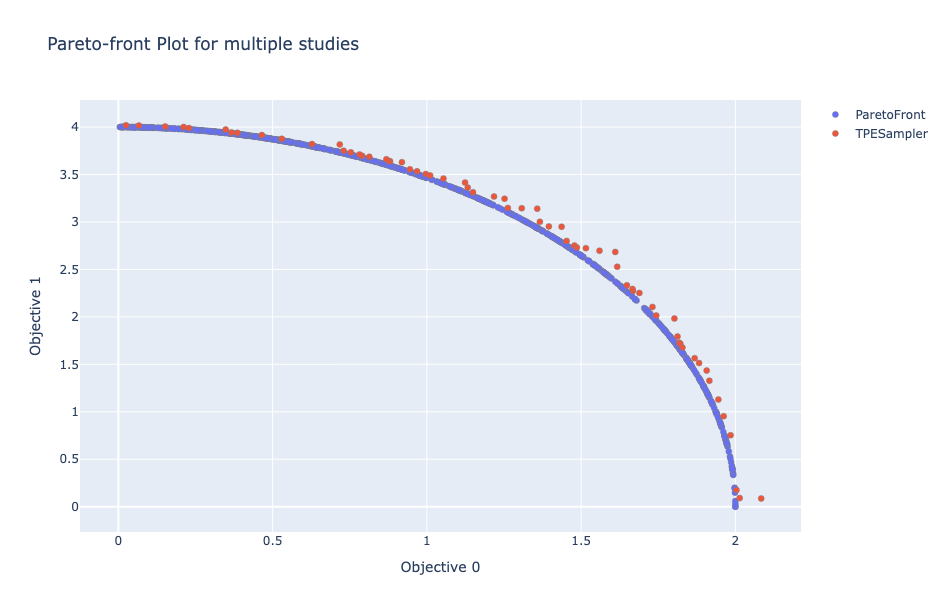

## Abstract

This package provides a wrapper of the [optproblems](https://www.simonwessing.de/optproblems/doc/index.html) library's WFG test suite, which consists of 9 kinds of continuous problems with variadic objectives and variables. For the details of the benchmark problems, please take a look at the original paper (Huband et al., 2006) in the reference section.

## APIs

### class `Problem(function_id: int, n_objectives: int, dimension: int, k: int | None = None, **kwargs: Any)`

- `function_id`: Function ID of the WFG problem in \[1, 9\].
- `n_objectives`: Number of objectives.
- `dimension`: Number of variables.
- `k`: Number of position parameters. It must hold k \< dimension and k must be a multiple of n_objectives - 1. Huband et al. recommend k = 4 for two objectives and k = 2 * (m - 1) for m objectives. If `None` is set, this recommendation is used.
- `kwargs`: Arbitrary keyword arguments, please refer to [the optproblems documentation](https://www.simonwessing.de/optproblems/doc/wfg.html) for more details.

#### Methods and Properties

- `search_space`: Return the search space.
  - Returns: `dict[str, optuna.distributions.BaseDistribution]`
- `directions`: Return the optimization directions.
  - Returns: `list[optuna.study.StudyDirection]`
- `__call__(trial: optuna.Trial)`: Evaluate the objective functions and return the objective values.
  - Args:
    - `trial`: Optuna trial object.
  - Returns: `float`
- `evaluate(params: dict[str, float])`: Evaluate the objective functions and return the objective values.
  - Args:
    - `params`: Decision variable like `{"x0": x1_value, "x1": x1_value, ..., "xn": xn_value}`. The number of parameters must be equal to `dimension`.
  - Returns: `float`

The properties defined by [optproblems](https://www.simonwessing.de/optproblems/doc/wfg.html) are also available such as `get_optimal_solutions`.

## Installation

Please install the [optproblems](https://pypi.org/project/optproblems/) package.

```shell
pip install -U optproblems
```

## Example

```python
import optuna
import optunahub


wfg = optunahub.load_module("benchmarks/wfg")
wfg4 = wfg.Problem(function_id=4, n_objectives=2, dimension=3, k=1)

study_pareto = optuna.create_study(
    study_name="ParetoFront", directions=wfg4.directions
)
for x in wfg4.get_optimal_solutions(1000):  # Generate 1000 Pareto optimal solutions
    study_pareto.enqueue_trial(params={
        f"x{i}": x.phenome[i] for i in range(3)
    })
study_pareto.optimize(wfg4, n_trials=1000)

study_tpe = optuna.create_study(
    study_name="TPESampler",
    sampler=optuna.samplers.TPESampler(seed=42), directions=wfg4.directions
)
study_tpe.optimize(wfg4, n_trials=1000)

optunahub.load_module("visualization/plot_pareto_front_multi").plot_pareto_front(
    [study_pareto, study_tpe]
).show()
```



## Reference

Huband, S., Hingston, P., Barone, L., & While, L. (2006). [A review of multiobjective test problems and a scalable test problem toolkit](https://doi.org/10.1109/TEVC.2005.861417). IEEE Transactions on Evolutionary Computation, 10(5), 477-506.
