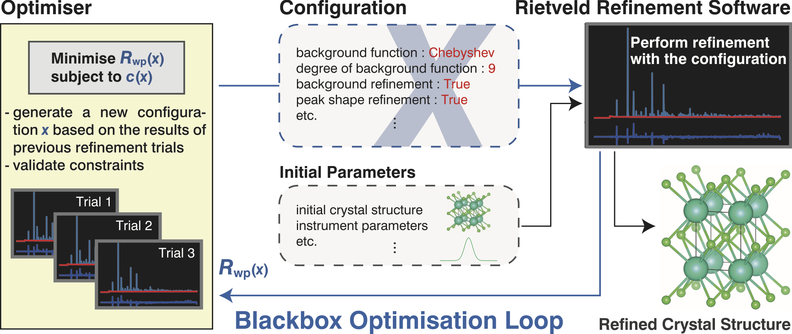
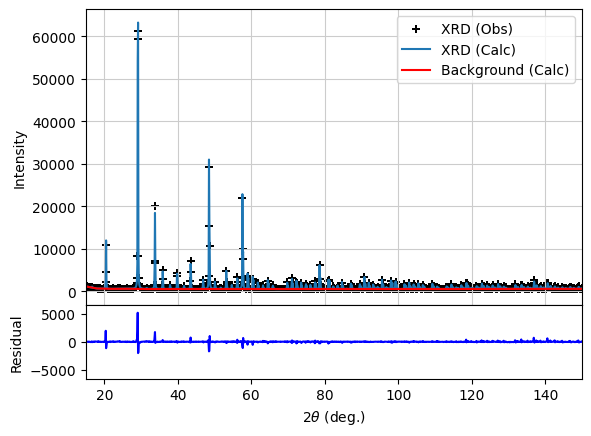

## Class or Function Names

- BboRietveldSampler
- create_objective
- ProjectConfig
- rietveld_plot

## Installation

### Installation of GSAS-II

- Please refer the official documantation of GSAS-II
  - https://github.com/AdvancedPhotonSource/GSAS-II
  - [the installation guide](https://advancedphotonsource.github.io/GSAS-II-tutorials/install.html)
- A Docker image including GSAS-II is also available in the BBO-Rietveld repository.
  - https://github.com/quantumbeam/BBO-Rietveld
  ```bash
  docker pull resnant/bbo-rietveld:v1.1
  ```

## Example

Implementation of BBO-Rietveld, automated crystal structure analysis method based on blackbox optimisation.\

This image is taken from [the BBO-Rietveld paper](https://www.nature.com/articles/s41524-020-0330-9) under a Creative Commons Attribution 4.0 International License.

To execute following example, please make directory `Y2O3_data` in the same directory of this code and copy `Y2O3.cif`, `Y2O3.csv`, `INST_XRY.PRM` from https://github.com/quantumbeam/BBO-Rietveld/tree/master/data/Y2O3 into `Y2O3_data`.

```python
import os

import matplotlib.pyplot as plt
import optuna
import optunahub


if __name__ == "__main__":
    bbo_rietveld = optunahub.load_module(
        package="samplers/bbo_rietveld",
    )

    STUDY_NAME = "Y2O3"

    config = bbo_rietveld.ProjectConfig(
        random_seed=1024,
        work_dir="work/" + STUDY_NAME,
        data_dir="Y2O3_data/",
        cif_file="Y2O3.cif",
        powder_histogram_file="Y2O3.csv",
        instrument_parameter_file="INST_XRY.PRM",
        two_theta_lower=15,
        two_theta_upper=150,
        two_theta_margin=20,
        validate_Uiso_nonnegative=True,
    )

    objective_fn = bbo_rietveld.create_objective(config=config)
    os.makedirs(config.work_dir, exist_ok=True)
    study = optuna.create_study(
        study_name=STUDY_NAME,
        sampler=bbo_rietveld.BboRietveldSampler(seed=config.random_seed, n_startup_trials=10),
    )

    study.optimize(objective_fn, n_trials=100)
    print(f"\n### best params:\n{study.best_params}")
    fig = bbo_rietveld.rietveld_plot(
        config=config, gpx_path=study.best_trial.user_attrs["gpx_path"]
    )
    plt.show()

```



## Others

### Reference

Ozaki, Y., Suzuki, Y., Hawai, T. Saito, K., Onishi, M., Ono, K. "Automated crystal structure analysis based on blackbox optimisation." <i>npj Comput Mater</i> <b>6</b>, 75 (2020). https://www.nature.com/articles/s41524-020-0330-9

See the [paper](https://www.nature.com/articles/s41524-020-0330-9) for more details.

### BibTeX

```bibtex
@article{ozaki2020automated,
  title={Automated crystal structure analysis based on blackbox optimisation},
  author={Ozaki, Yoshihiko and Suzuki, Yuta and Hawai, Takafumi and Saito, Kotaro and Onishi, Masaki and Ono, Kanta},
  journal={npj Computational Materials},
  volume={6},
  number={1},
  pages={1--7},
  pages = {75},
  doi = {10.1038/s41524-020-0330-9},
  year={2020},
  publisher={Nature Publishing Group}
}
```
