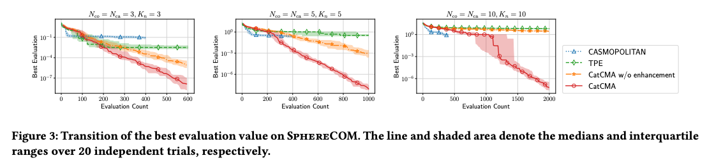

## Abstract

The cutting-edge evolutionary computation algorithm CatCMA has been published on OptunaHub.
CatCMA is an algorithm that excels in mixed search spaces with continuous and discrete variables.


This figure is from https://arxiv.org/abs/2405.09962.

📝 [**Introduction to CatCMA in OptunaHub**](https://medium.com/optuna/introduction-to-catcma-in-optunahub-ffa316309cb8): Blog post by Hideki Imamura.

## Class or Function Names

- CatCmaSampler

## Installation

```bash
pip install -r requirements.txt
```

## Example

[](https://colab.research.google.com/github/optuna/optunahub-registry/blob/main/package/samplers/catcma/example.ipynb)

```python
import numpy as np
import optuna
from optuna.distributions import CategoricalDistribution
from optuna.distributions import FloatDistribution
import optunahub


def objective(trial: optuna.Trial) -> float:
    x1 = trial.suggest_float("x1", -1, 1)
    x2 = trial.suggest_float("x2", -1, 1)
    x3 = trial.suggest_float("x3", -1, 1)
    X = np.array([x1, x2, x3])

    c1 = trial.suggest_categorical("c1", [0, 1, 2])
    c2 = trial.suggest_categorical("c2", [0, 1, 2])
    c3 = trial.suggest_categorical("c3", [0, 1, 2])
    C = np.array([c1, c2, c3])

    return sum(X**2) + len(C) - sum(C == 0)


if __name__ == "__main__":
    mod = optunahub.load_module(
        package="samplers/catcma",
    )
    CatCmaSampler = mod.CatCmaSampler

    study = optuna.create_study(
        sampler=CatCmaSampler(
            search_space={
                "x1": FloatDistribution(-1, 1),
                "x2": FloatDistribution(-1, 1),
                "x3": FloatDistribution(-1, 1),
                "c1": CategoricalDistribution([0, 1, 2]),
                "c2": CategoricalDistribution([0, 1, 2]),
                "c3": CategoricalDistribution([0, 1, 2]),
            }
        )
    )
    study.optimize(objective, n_trials=20)
    print(study.best_params)

    # You can omit the search space definition before optimization.
    # Then, the search space will be estimated during the first trial.
    # In this case, independent_sampler (default: RandomSampler) will be used instead of the CatCma algorithm for the first trial.
    study = optuna.create_study(sampler=CatCmaSampler())
    study.optimize(objective, n_trials=20)
    print(study.best_params)
```

## Others

### Reference

Ryoki Hamano, Shota Saito, Masahiro Nomura, Kento Uchida, Shinichi Shirakawa , CatCMA : Stochastic Optimization for Mixed-Category Problems, GECCO'24

See the [arXiv paper](https://arxiv.org/abs/2405.09962) or [ACM paper](https://doi.org/10.1145/3638529.3654198) for more details.

### BibTeX

```bibtex
@article{hamano2024catcma,
  title={CatCMA: Stochastic Optimization for Mixed-Category Problems},
  author={Hamano, Ryoki and Saito, Shota and Nomura, Masahiro and Uchida, Kento and Shirakawa, Shinichi},
  journal={arXiv preprint arXiv:2405.09962},
  year={2024}
}
```
