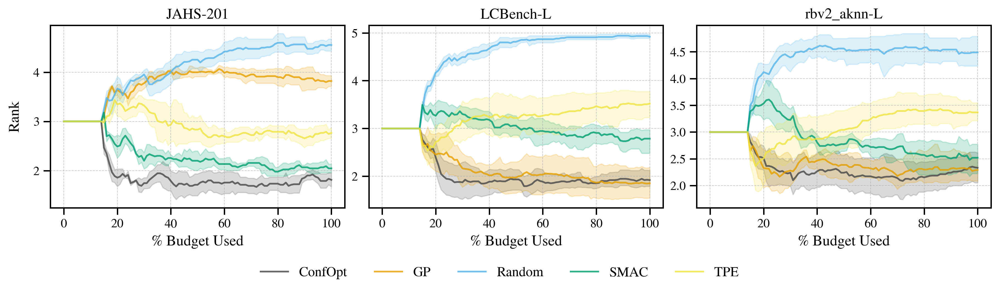

## Abstract

`ConfOptSampler` provides flexible and robust hyperparameter optimization via calibrated quantile regression surrogates.

It supports the following acquisition functions:

- Thompson Sampling
- Optimistic Bayesian Sampling
- Expected Improvement

It is robust to heteroskedastic, skewed, non-normal and highly categorical environments where traditional GPs might fail.

Its single-fidelity performance in popular HPO benchmarks puts it consistently ahead of TPE and SMAC and contextually ahead of GPs (when hyperparameters are categorical):



## API

`ConfOptSampler` class takes the following parameters:

- `searcher`: Quantile regression architecture to use for searcher. Choose from:
  - "qgbm" (default): Quantile Gradient Boosting Machine.
  - "qe": Quantile Ensemble (this usually performs better than "qgbm", but is significantly slower, so only use it if your base model takes longer than 10 minutes per training episode)
- `acquisition_function`: Acquisition function for selecting next configurations. Choose from:
  - "thompson_sampling"
  - "optimistic_bayesian_sampling" (default)
  - "expected_improvement"
- `n_candidates`: Number of candidate configurations to pass to the acquisition function (default: 3000).
- `n_startup_trials`: Number of random trials before switching to quantile search (default: 10).
- `train_on_pruned_trials`: Whether to include pruned trials in model training (default: False).
- `seed`: Random seed for reproducibility.

For more detail on how to use `ConfOptSampler`, refer to the code example below or the code's doc strings.

## Installation

To use ConfOptSampler you'll need to install the base ConfOpt package. You can do so either directly via:

```shell
$ pip install confopt
```

or via the OptunaHub requirements, via:

```bash
pip install -r https://hub.optuna.org/samplers/confopt/requirements.txt
```

## Example

```python
import optuna
import optunahub

# Set objective function:
def objective(trial: optuna.trial.Trial) -> float:
    x = trial.suggest_float("x", -10, 10)
    y = trial.suggest_int("y", -10, 10)
    
    return x**2 + y**2

# Set up sampler:
module = optunahub.load_module("samplers/confopt_sampler")
sampler = module.ConfOptSampler(
    # Search space below must match the one defined in the objective function:
    search_space={
        "x": optuna.distributions.FloatDistribution(-10, 10),
        "y": optuna.distributions.IntDistribution(-10, 10),
    },
    # Number of random searches before switching to inferential search:
    n_startup_trials=10
)

# Run study:
study = optuna.create_study(sampler=sampler)
study.optimize(objective, n_trials=100)

print(f"Best trial parameters: {study.best_trial.params}")
print(f"Best trial value: {study.best_trial.value}")
```

## Resources

### Source Code

[ConfOpt](https://github.com/rick12000/confopt) is a standalone hyperparameter optimization package available on [PyPI](https://pypi.org/project/confopt/) via `pip install confopt`.

Source code can be found at the package's [GitHub](https://github.com/rick12000/confopt) repository and errors encountered while running ConfOpt in Optuna (that are traceable to the ConfOpt package itself), should be reported on ConfOpt's [Issues](https://github.com/rick12000/confopt/issues) page.

### Paper

The latest source paper covering the main methods used in ConfOpt can be found at:

```bibtex
@misc{doyle2025enhancingperformancecalibrationquantile,
      title={Enhancing Performance and Calibration in Quantile Hyperparameter Optimization}, 
      author={Riccardo Doyle},
      year={2025},
      eprint={2509.17051},
      archivePrefix={arXiv},
      primaryClass={cs.LG},
      url={https://arxiv.org/abs/2509.17051}, 
}
```
