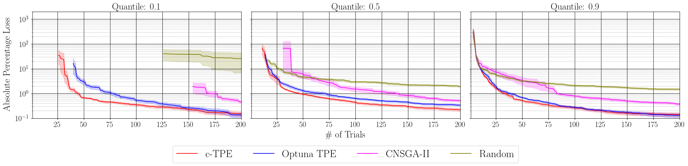

## Abstract

This package aims to reproduce the TPE algorithm used in the paper published at IJCAI'23:

- [c-TPE: Tree-structured Parzen Estimator with Inequality Constraints for Expensive Hyperparameter Optimization](https://arxiv.org/abs/2211.14411)

The default parameter set of this sampler is the recommended setup from the paper and the experiments in the paper can also be reproduced by this sampler.

Note that this sampler is officially implemented by the first author of the original paper.
The performance was verified using Optuna v4.1.0 by reproducing the results of Fig. 3 (Top Row) in the original paper.



## Class or Function Names

- cTPESampler

Although most arguments in [`TPESampler`](https://optuna.readthedocs.io/en/stable/reference/samplers/generated/optuna.samplers.TPESampler.html) are also available for `cTPESampler`, the original paper uses the default arguments of this sampler.
However, `constraints_func` must be provided to use this sampler.
For the reproducibility purpose, please set a fixed `seed`.
Please refer to [the documentation of CustomizableTPESampler](https://hub.optuna.org/samplers/tpe_tutorial/) for more details of the other arguments such as `bandwidth_strategy` and `b_magic_exponent`.

## Installation

The version constraint of this package is Optuna v4.0.0 or later.

```shell
# The requirement is only Optuna.
$ pip install optuna

# You can also optionally install as follows:
$ pip install -r https://hub.optuna.org/samplers/ctpe/requirements.txt
```

## Example

This sampler is the official implementation of [the c-TPE paper](https://arxiv.org/abs/2211.14411).

```python
from __future__ import annotations

import numpy as np
import optuna
import optunahub


def objective(trial: optuna.Trial) -> float:
    x = trial.suggest_float("x", 0.0, 2 * np.pi)
    y = trial.suggest_float("y", 0.0, 2 * np.pi)
    return float(np.sin(x) + y)


def constraints(trial: optuna.trial.FrozenTrial) -> tuple[float]:
    x = trial.params["x"]
    y = trial.params["y"]
    c = float(np.sin(x) * np.sin(y) + 0.95)
    trial.set_user_attr("c", c)
    return (c, )


sampler = optunahub.load_module(package="samplers/ctpe").cTPESampler(constraints_func=constraints)
study = optuna.create_study(sampler=sampler)
study.optimize(objective, n_trials=30)
print(study.best_trials)

```

### Bibtex

When you use this sampler, please cite the following:

```bibtex
@inproceedings{watanabe_ctpe_ijcai_2023,
    title={{c-TPE}: Tree-structured {P}arzen Estimator with Inequality Constraints for Expensive Hyperparameter Optimization},
    author={Watanabe, Shuhei and Hutter, Frank},
    booktitle={International Joint Conference on Artificial Intelligence},
    year={2023}
}

@inproceedings{watanabe_ctpe_workshop_2022,
    title={{c-TPE}: Generalizing Tree-structured {P}arzen Estimator with Inequality Constraints for Continuous and Categorical Hyperparameter Optimization},
    author={Watanabe, Shuhei and Hutter, Frank},
    journal = {Gaussian Processes, Spatiotemporal Modeling, and Decision-making Systems Workshop at Advances in Neural Information Processing Systems},
    year={2022}
}
```
