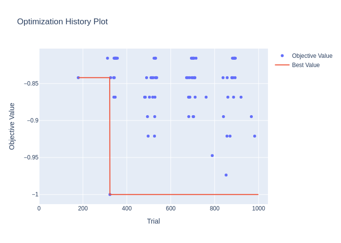
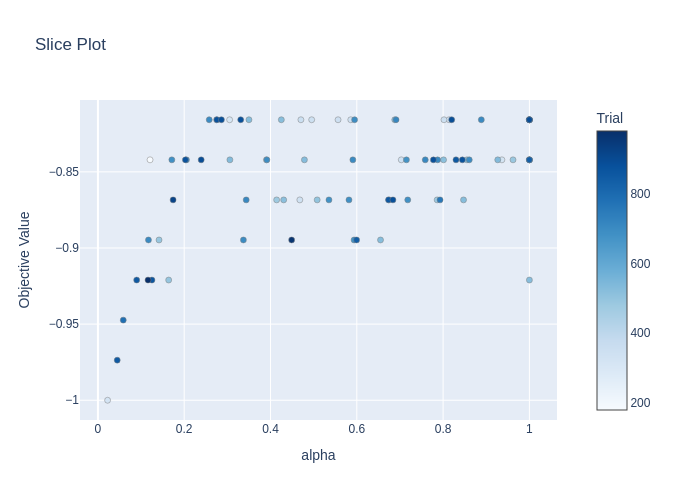
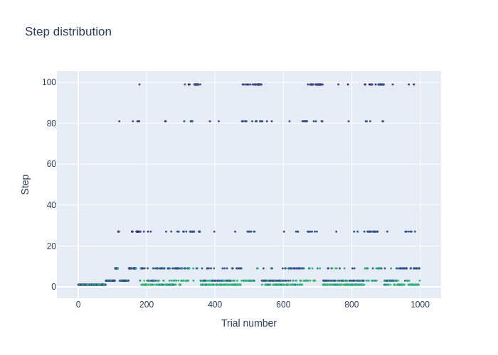

## Class or Function Names

- `DEHBSampler`
- `DEHBPruner`

## Installation

There is no additional installation required for this sampler and pruner, but if you want to run the `example.py` script, you need to install the following packages:

```bash
$ pip install sklearn
```

## Example

```python
sampler = DEHBSampler()
pruner = DEHBPruner(min_resource=1, max_resource=n_train_iter, reduction_factor=3)
study = optuna.create_study(sampler=sampler, pruner=pruner)
```

See [`example.py`](https://github.com/optuna/optunahub-registry/blob/main/package/samplers/dehb/example.py) for a full example.
The following figures are obtained from the analysis of the optimization.




## Others

### References

Awad, N. H., Mallik, N., & Hutter, F. (2021). DEHB: Evolutionary hyberband for scalable, robust and efficient hyperparameter optimization. In Z. Zhou (Ed.), Proceedings of the Thirtieth International Joint Conference on Artificial Intelligence (IJCAI-21) (pp. 2147–2153).
