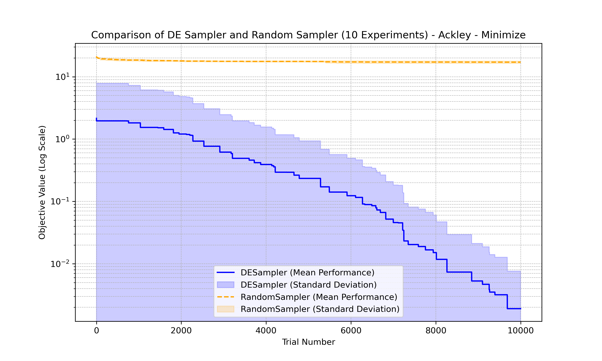
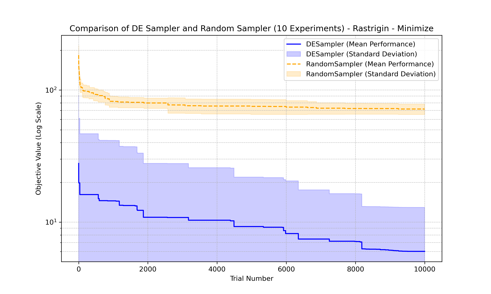
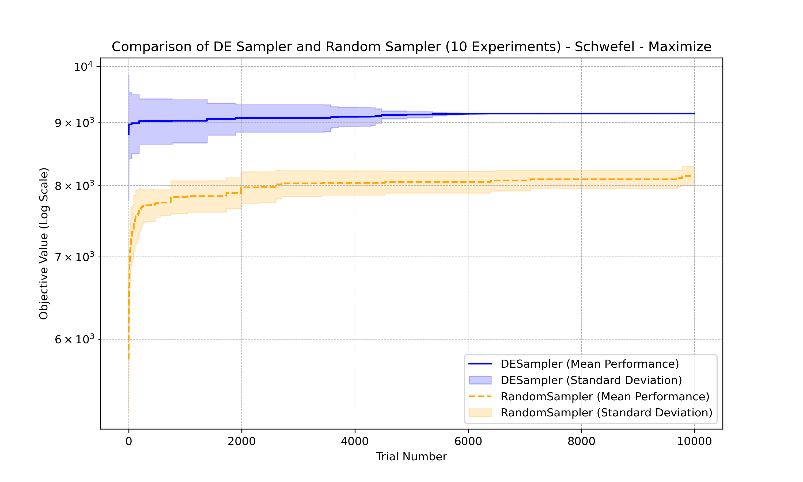
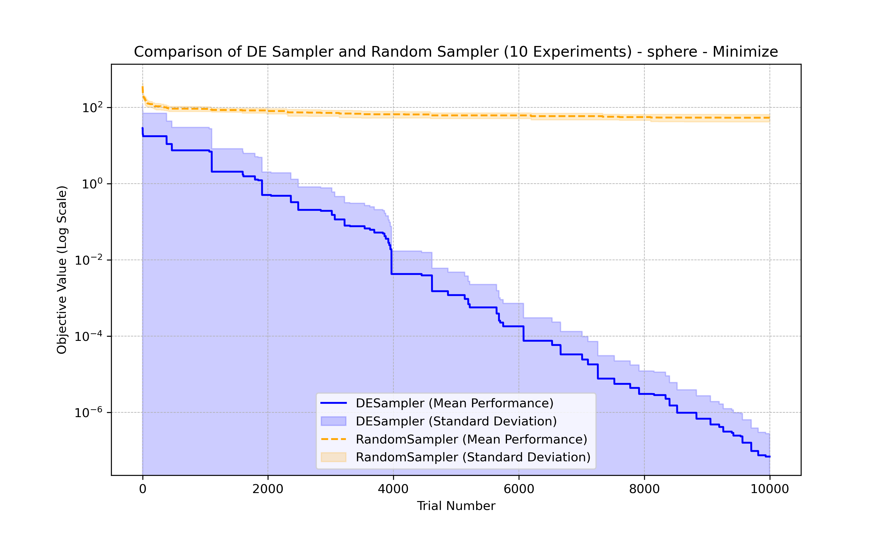

## Abstract

### Differential Evolution (DE) Sampler

This implementation introduces a novel Differential Evolution (DE) sampler, tailored to optimize both numerical and categorical hyperparameters effectively. The DE sampler integrates a hybrid approach:

1. **Differential Evolution for Numerical Parameters:** Exploiting DE’s strengths, the sampler efficiently explores numerical parameter spaces through mutation, crossover, and selection mechanisms.
1. **Random Sampling for Categorical Parameters:** For categorical variables, the sampler employs random sampling, ensuring comprehensive coverage of discrete spaces.

The sampler also supports **dynamic search spaces**, enabling seamless adaptation to varying parameter dimensions during optimization. To maintain diversity and scalability, the population size is adaptively determined based on the search space dimensionality.

### Performance Verification

The sampler's performance was validated using four standard optimization benchmarks:

- **Ackley function (Minimization)**
- **Rastrigin function (Minimization)**
- **Sphere function (Minimization)**
- **Schwefel function (Maximization)**

Each benchmark was tested across 10 experiments. The results demonstrate superior performance in convergence speed and objective value minimization/maximization compared to a random sampling baseline.

The plots below illustrate the comparative performance, showcasing both mean performance and standard deviation for the DE and random samplers across trial numbers.

<table style="width: 100%;">
  <tr>
    <td style="width: 50%;"></td>
    <td style="width: 50%;"></td>
  </tr>
  <tr>
    <td style="width: 50%;"></td>
    <td style="width: 50%;"></td>
  </tr>
</table>

## APIs

### Differential Evolution (DE) Sampler API Documentation

The `DESampler` is a hybrid sampler designed to optimize both numerical and categorical hyperparameters efficiently. It combines Differential Evolution (DE) for numerical parameter optimization and random sampling for categorical parameters, making it versatile and scalable for various optimization tasks.

______________________________________________________________________

### Class: `DESampler`

```python
  DESampler(
      search_space: dict[str, optuna.distributions.BaseDistribution] | None = None,
      population_size: int | str = "auto",
      F: float = 0.8,
      CR: float = 0.7,
      debug: bool = False,
      seed: int | None = None
  )
```

### Parameters

#### `search_space`

A dictionary containing the search space that defines the parameter space. The keys are parameter names, and the values are [Optuna distributions](https://optuna.readthedocs.io/en/stable/reference/distributions.html) specifying the parameter ranges.

**Example**:

```python
search_space = {
    "x": optuna.distributions.FloatDistribution(-5, 5),
    "y": optuna.distributions.FloatDistribution(-5, 5),
    "z": optuna.distributions.CategoricalDistribution([0, 1, 2]),
}
sampler = DESampler(search_space=search_space)
```

______________________________________________________________________

#### `population_size`

The number of individuals in the population. If set to `"auto"`, the population size is dynamically determined based on the dimensionality of the search space. You can specify a custom integer value for precise control over population size.

- **Default**: `"auto"`
- **Example**: `population_size=50`

______________________________________________________________________

#### `F`

Mutation scaling factor. Controls the amplification of the difference between two individuals in DE.

- **Default**: `0.8`
- **Range**: `[0.0, 2.0]`

______________________________________________________________________

#### `CR`

Crossover probability. Controls the fraction of parameter values copied from the mutant during crossover.

- **Default**: `0.7`
- **Range**: `[0.0, 1.0]`

______________________________________________________________________

#### `debug`

A toggle to enable or disable debug messages for performance monitoring and troubleshooting.

- **Default**: `False`
- **Example**: `debug=True`

______________________________________________________________________

#### `seed`

Seed for the random number generator, ensuring reproducibility of results.

- **Default**: `None`
- **Example**: `seed=42`

## Installation

No additional packages besides `optuna` and `optunahub` are required.

## Example

```python
import optuna
import math
import optunahub


# Define the Rastrigin objective function
def objective_rastrigin(trial):
    n_dimensions = 10  # Dimensionality of the problem
    variables = [trial.suggest_float(f"x{i}", -5.12, 5.12) for i in range(n_dimensions)]
    A = 10
    result = A * n_dimensions + sum(x**2 - A * math.cos(2 * math.pi * x) for x in variables)
    return result

# Initialize the DE Sampler
module = optunahub.load_module("samplers/differential_evolution")
DESampler = module.DESampler
sampler = DESampler(population_size="auto", F=0.8, CR=0.9, seed=42)

# Create and optimize the study
study = optuna.create_study(direction="minimize", sampler=sampler)
study.optimize(objective_rastrigin, n_trials=10000)

# Print the results
print("Best parameters:", study.best_params)
print("Best value:", study.best_value)
```

For a comprehensive example with benchmarking, see [example.py](https://github.com/optuna/optunahub-registry/blob/main/package/samplers/differential_evolution/example.py).
