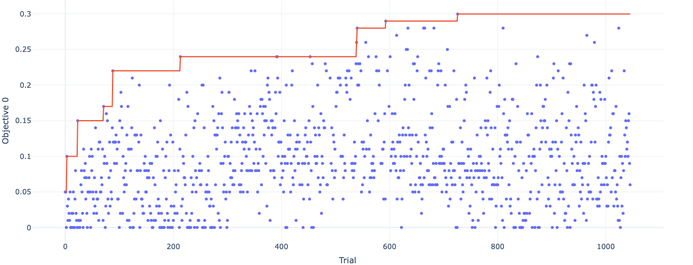
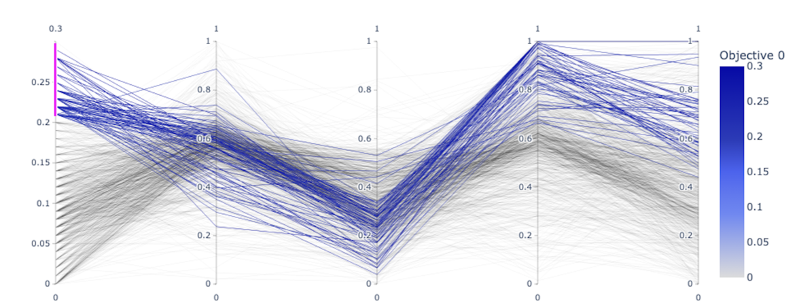

## Class or Function Names
- EvoMergeSampler
- EvoMergeTrial

## Installation
```bash
pip install git+https://github.com/arcee-ai/mergekit.git
pip install sentencepiece accelerate protobuf bitsandbytes langchain langchain-community datasets
pip install pandas cmaes
export HF_TOKEN=xxx
```

## Example
```python
sampler = EvoMergeSampler(base_config="path/to/config/yml/file")
study = optuna.create_study(sampler=sampler)

for _ in range(100):
    trial = study.ask()
    evo_merge_trial = EvoMergeTrial(study, trial._trial_id)
    model = evo_merge_trial.suggest_model()

    acc = try_model(model)

    study.tell(trial, acc)

print(study.trials_dataframe(attrs=("number", "value")))
```
See `example.py` for a full example. You need GPU with 16G VLAM to run this example.
The following figures are obtained from the analysis of the optimization.



## Others

### Reference
Akiba, T., Shing, M., Tang, Y., Sun, Q., & Ha, D. (2024). Evolutionary Optimization of Model Merging Recipes. arXiv preprint arXiv:2403.13187.
