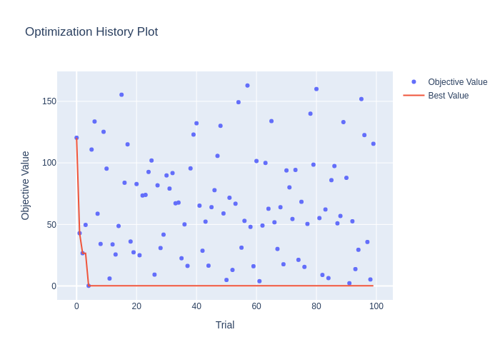

## Class or Function Names

- HEBOSampler

## Installation

```bash
pip install -r https://hub.optuna.org/samplers/hebo/requirements.txt
git clone git@github.com:huawei-noah/HEBO.git
cd HEBO/HEBO
pip install -e .
```

## APIs

- `HEBOSampler(*, search_space: dict[str, BaseDistribution] | None = None, seed: int | None = None, constant_liar: bool = False, independent_sampler: BaseSampler | None = None)`
  - `search_space`: A search space required for Define-and-Run manner.

    Example:

    ```python
    search_space = {
        "x": optuna.distributions.FloatDistribution(-5, 5),
        "y": optuna.distributions.FloatDistribution(-5, 5),
    }
    HEBOSampler(search_space=search_space)
    ```

  - `seed`: Seed for random number generator.

  - `constant_liar`: If `True`, penalize running trials to avoid suggesting parameter configurations nearby. Default is `False`.

    - Note: Abnormally terminated trials often leave behind a record with a state of `RUNNING` in the storage. Such "zombie" trial parameters will be avoided by the constant liar algorithm during subsequent sampling. When using an `optuna.storages.RDBStorage`, it is possible to enable the `heartbeat_interval` to change the records for abnormally terminated trials to `FAIL`. (This note is quoted from [TPESampler](https://github.com/optuna/optuna/blob/v4.1.0/optuna/samplers/_tpe/sampler.py#L215-L222).)
    - Note: It is recommended to set this value to `True` during distributed optimization to avoid having multiple workers evaluating similar parameter configurations. In particular, if each objective function evaluation is costly and the durations of the running states are significant, and/or the number of workers is high. (This note is quoted from [TPESampler](https://github.com/optuna/optuna/blob/v4.1.0/optuna/samplers/_tpe/sampler.py#L224-L229).)
    - Note: HEBO algorithm involves multi-objective optimization of multiple acquisition functions. While `constant_liar` is a simple way to get diverse params for parallel optimization, it may not be the best approach for HEBO.

  - `independent_sampler`: A `optuna.samplers.BaseSampler` instance that is used for independent sampling. The parameters not contained in the relative search space are sampled by this sampler. If `None` is specified, `optuna.samplers.RandomSampler` is used as the default.

## Example

```python
import optuna
import optunahub


def objective(trial: optuna.trial.Trial) -> float:
    x = trial.suggest_float("x", -10, 10)
    y = trial.suggest_int("y", -10, 10)
    return x**2 + y**2


module = optunahub.load_module("samplers/hebo")
sampler = module.HEBOSampler(search_space={
    "x": optuna.distributions.FloatDistribution(-10, 10),
    "y": optuna.distributions.IntDistribution(-10, 10),
})
study = optuna.create_study(sampler=sampler)
study.optimize(objective, n_trials=100)

print(study.best_trial.params, study.best_trial.value)
```

See [`example.py`](https://github.com/optuna/optunahub-registry/blob/main/package/samplers/hebo/example.py) for a full example.


## Others

HEBO is the winning submission to the [NeurIPS 2020 Black-Box Optimisation Challenge](https://bbochallenge.com/leaderboard).
Please refer to [the official repository of HEBO](https://github.com/huawei-noah/HEBO/tree/master/HEBO) for more details.

### Reference

Cowen-Rivers, Alexander I., et al. "An Empirical Study of Assumptions in Bayesian Optimisation." arXiv preprint arXiv:2012.03826 (2021).
