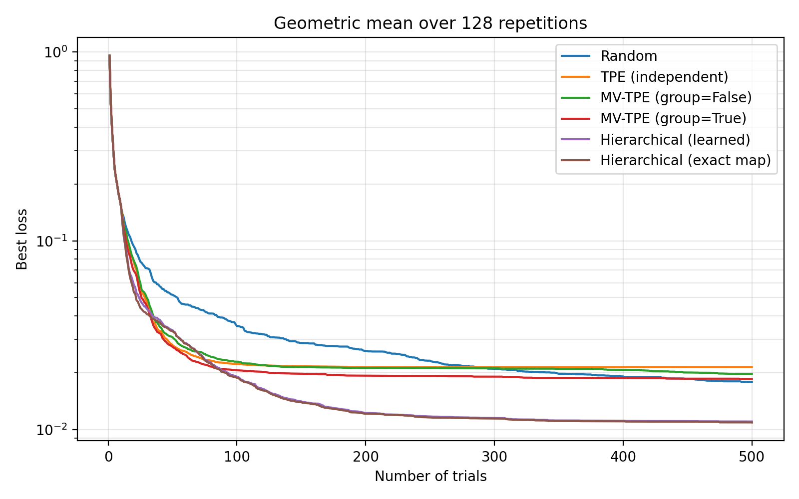

## Abstract

`HierarchicalTPESampler` is a mixture-of-experts variant of Optuna's multivariate,
group-decomposed `TPESampler` for **conditional search spaces** (objectives where different
trials request different parameters, e.g. `if optimizer == "adam": ...`).

**Why this exists.** On a conditional (dynamic) search space, Optuna's own multivariate
`TPESampler` is inadequate. With `group=False` the conditional parameters fall back to
independent (random) sampling, because a dynamic search space is not supported for
`multivariate=True`. With `group=True` the space is decomposed into parameter groups that are
each sampled **independently**, so correlation *between* groups is lost.

`HierarchicalTPESampler` keeps the group decomposition but samples the groups **conditionally**:
it decomposes the search space into Optuna parameter groups (sets of parameters that always
co-occur), infers a parent/child hierarchy between them, and gives each group its own Parzen
estimators ("experts"). For every expected-improvement candidate it samples the always-present
parameters first, then routes to the conditional children based on the values just sampled —
either with a learned `DecisionTreeClassifier` or with a user-supplied exact map. This lets it
capture correlation **across** conditional subspaces (e.g. between an always-present parameter
and a parameter that only appears in one branch), which independent group sampling cannot.

This is one of the two approaches proposed in
[optuna#5299](https://github.com/optuna/optuna/issues/5299). The other — the union-search-space
approach — is explored in [optuna#6697](https://github.com/optuna/optuna/pull/6697). See
[Difference from the union-search-space approach](#difference-from-the-union-search-space-approach).

## Class or Function Names

- `HierarchicalTPESampler`

### Arguments

`HierarchicalTPESampler` accepts the same arguments as
[`TPESampler`](https://optuna.readthedocs.io/en/stable/reference/samplers/generated/optuna.samplers.TPESampler.html)
(such as `n_startup_trials`, `n_ei_candidates`, `seed`, `constraints_func`, `constant_liar`,
`gamma`, `weights`), plus:

- `conditional_fn` (`Callable[[dict[str, Any]], Iterable[str]] | None`, default `None`): an
  optional **exact map** of the conditional structure — see
  [The conditional_fn exact map](#the-conditional_fn-exact-map) below for its exact input/output.
  If `None`, the structure is learned from observed trials with a `DecisionTreeClassifier`.

`multivariate` and `group` default to `True` because the hierarchical algorithm requires them. If
either is set to `False`, the sampler logs an INFO message and falls back to the standard
`TPESampler` behavior. With no conditional structure, the sampler is identical to
`TPESampler(multivariate=True, group=True)`.

The hierarchy is always inferred automatically and is self-correcting: if a branch is
mispredicted, the objective requests a parameter that was not sampled hierarchically, and that
parameter is drawn by independent (univariate) TPE instead; the structure is re-inferred and the
classifier refit on subsequent trials.

### The conditional_fn exact map

`conditional_fn` lets you state the objective's branching exactly instead of having it learned.
Its signature is `Callable[[dict[str, Any]], Iterable[str]]`, and the sampler calls it **once per
hierarchy level** while building each candidate:

- **Input** — a dict of every parameter sampled *so far on the current branch path*, keyed by
  name, with values in the **external representation** (exactly as in `trial.params`: the chosen
  category, the float/int value). It holds the always-present parameters plus any conditional
  parameters already chosen higher up the path; it does **not** contain parameters that have not
  been sampled yet.
- **Output** — an iterable of the **names of the parameters the objective requests next** given
  that input (the parameters the very next `suggest_*` call(s) would use). Return an empty list at
  a leaf (no further parameter). A conditional parameter group becomes active for the candidate
  when all of its parameter names are in the returned set; returning extra names is harmless.

**Single-level example** — `x` and `t` are always requested and `y`/`z` are conditional, so the
map mirrors the `if x == "A"`:

```python
def objective(trial):
    x = trial.suggest_categorical("x", ["A", "B"])
    t = trial.suggest_float("t", -2, 2)  # always requested
    if x == "A":
        return (trial.suggest_float("y", 1, 2) - t) ** 2
    return (trial.suggest_float("z", -2, 1) - t) ** 2


def conditional_fn(params: dict) -> list[str]:
    # e.g. params == {"x": "A", "t": 0.3}  ->  the objective requests "y" next
    return ["y"] if params["x"] == "A" else ["z"]
```

**Multi-level example** — when the branching is nested, `conditional_fn` is called once per
level with progressively more parameters, so branch on whichever gate is already present:

```python
def objective(trial):
    x = trial.suggest_categorical("x", [True, False])
    y = trial.suggest_float("y", -1, 1)  # always requested
    if x:
        if trial.suggest_categorical("n", [True, False]):
            return (trial.suggest_float("a", -1, 1) - y) ** 2
        return (trial.suggest_float("b", -1, 1) - y) ** 2
    if trial.suggest_categorical("m", [True, False]):
        return (trial.suggest_float("c", -1, 1) - y) ** 2
    return (trial.suggest_float("d", -1, 1) - y) ** 2


def conditional_fn(params: dict) -> list[str]:
    # called as {"x": ..., "y": ...} -> next gate, then e.g. {"x": True, "y": ..., "n": ...} -> leaf
    if "n" in params:  # x was True; n decides a vs b
        return ["a"] if params["n"] else ["b"]
    if "m" in params:  # x was False; m decides c vs d
        return ["c"] if params["m"] else ["d"]
    return ["n"] if params["x"] else ["m"]  # top level: x decides n vs m
```

## Installation

```shell
$ pip install optuna scikit-learn

# or, equivalently:
$ pip install -r https://hub.optuna.org/samplers/hierarchical_tpe/requirements.txt
```

## Example

```python
from __future__ import annotations

import optuna
import optunahub


# A conditional search space: `x` gates whether `y` or `z` is requested, and the always-present
# `t` is coupled to whichever is active.
def objective(trial: optuna.Trial) -> float:
    x = trial.suggest_categorical("x", ["A", "B"])
    t = trial.suggest_float("t", -2, 2)
    if x == "A":
        y = trial.suggest_float("y", 1, 2)
        return (y - t) ** 2
    z = trial.suggest_float("z", -2, 1)
    return (z - t) ** 2


HierarchicalTPESampler = optunahub.load_module(
    package="samplers/hierarchical_tpe"
).HierarchicalTPESampler

sampler = HierarchicalTPESampler(seed=0)
study = optuna.create_study(sampler=sampler)
study.optimize(objective, n_trials=50)
print(study.best_params, study.best_value)
```

To state the branching exactly instead of having it learned, pass `conditional_fn` — see
[The conditional_fn exact map](#the-conditional_fn-exact-map).

## Difference from the union-search-space approach

[optuna#5299](https://github.com/optuna/optuna/issues/5299) proposed two ways for multivariate
TPE to handle correlated conditional subspaces:

1. **Union search space** ([optuna#6697](https://github.com/optuna/optuna/pull/6697),
   `group=False`): pad inactive parameters with `NaN` and estimate a single joint distribution
   over the union of all parameters.
1. **Hierarchical / mixture-of-experts** (this package, `group=True`): keep a separate expert per
   parameter group and route between them with an inferred hierarchy plus a classifier or exact
   map.

The union model estimates one joint distribution over the NaN-padded union of all parameters. The
hierarchical model instead scores each parameter group by its **conditional** ratio given its
always-present ancestors, which captures the correlation between an always-present parameter and a
conditional one. Because it predicts which branch is active, a mispredicted branch falls back to
independent sampling for the affected parameter.

## Benchmark

The benchmark below reproduces the comparison from
[optuna#5299](https://github.com/optuna/optuna/issues/5299) on a conditional objective with an
always-present parameter `y` coupled to whichever conditional leaf is active (so cross-subspace
correlation matters), over 128 repetitions with each sampler at its best `n_ei_candidates`. The
standard samplers converge quickly but plateau, while both `HierarchicalTPESampler` variants keep
improving — and reach the lowest loss — by exploiting the `y`-to-leaf correlation through the
conditional acquisition. Reproduce it with `python package/samplers/hierarchical_tpe/benchmark.py`.



The `MV-TPE (group=False)` curve uses standard independent fallback on released Optuna; run the
benchmark against the [optuna#6697](https://github.com/optuna/optuna/pull/6697) branch to obtain
the union-search-space curve instead.

### Reference

Proposed in [optuna#5299](https://github.com/optuna/optuna/issues/5299). The sibling
union-search-space approach is [optuna#6697](https://github.com/optuna/optuna/pull/6697).

### Test

```shell
$ pip install pytest
$ pytest package/samplers/hierarchical_tpe/tests/
```
