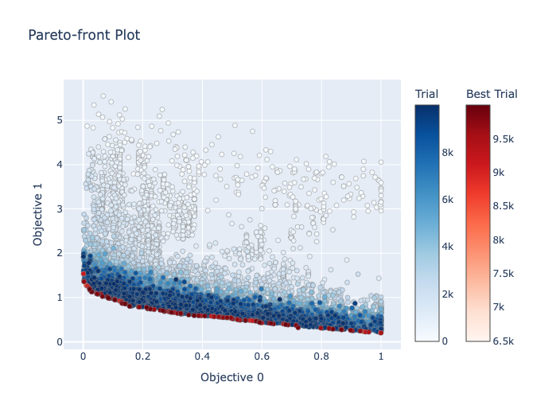
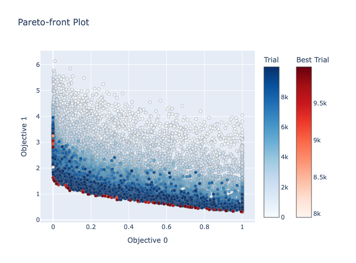
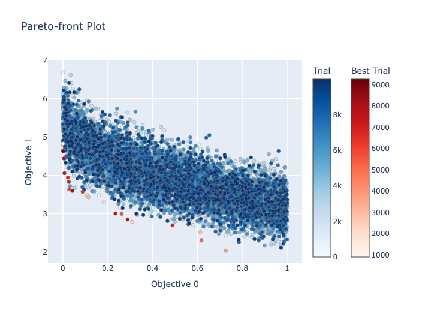
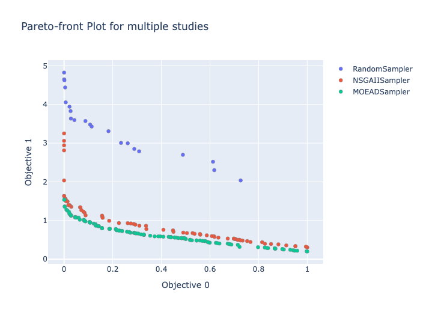

## Abstract

Sampler using MOEA/D algorithm. MOEA/D stands for "Multi-Objective Evolutionary Algorithm based on Decomposition.

This sampler is specialized for multiobjective optimization. The objective function is internally decomposed into multiple single-objective subproblems to perform optimization.

It may not work well with multi-threading. Check results carefully.

## Class or Function Names

- MOEADSampler

## Installation

```
pip install scipy
```

or

```
pip install -r https://hub.optuna.org/samplers/moead/requirements.txt
```

## Example

```python
import optuna
import optunahub

def objective(trial: optuna.Trial) -> tuple[float, float]:
    x = trial.suggest_float("x", 0, 5)
    y = trial.suggest_float("y", 0, 3)

    v0 = 4 * x**2 + 4 * y**2
    v1 = (x - 5) ** 2 + (y - 5) ** 2
    return v0, v1


population_size = 100
n_trials = 1000

mod = optunahub.load_module("samplers/moead")
sampler = mod.MOEADSampler(
    population_size=population_size,
    scalar_aggregation_func="tchebycheff",
    n_neighbors=population_size // 10,
)
study = optuna.create_study(sampler=sampler)
study.optimize(objective, n_trials=n_trials)
```

## Others

Comparison between Random, NSGAII and MOEA/D with ZDT1 as the objective function.
See `compare_2objective.py` in moead directory for details.

### Pareto Front Plot

| MOEA/D                      | NSGAII                       | Random                       |
| --------------------------- | ---------------------------- | ---------------------------- |
|  |  |  |

### Compare



### Reference

Q. Zhang and H. Li,
"MOEA/D: A Multiobjective Evolutionary Algorithm Based on Decomposition," in IEEE Transactions on Evolutionary Computation, vol. 11, no. 6, pp. 712-731, Dec. 2007,
[doi: 10.1109/TEVC.2007.892759](https://doi.org/10.1109/TEVC.2007.892759).
