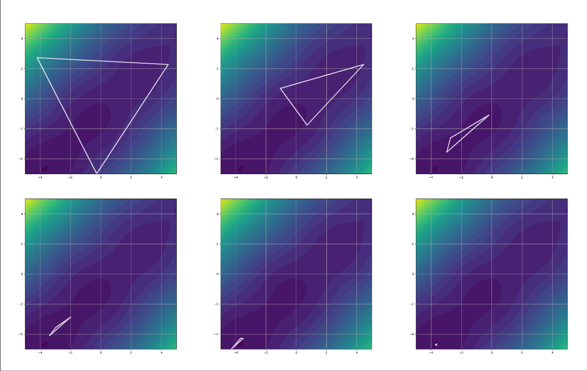

## Abstract

This Nelder-Mead method implemenation employs the effective initialization method proposed by Takenaga et al., 2023.



## Class or Function Names

- NelderMeadSampler

## Installation

```bash
pip install -r https://hub.optuna.org/samplers/nelder_mead/requirements.txt
```

## Example

```python
from __future__ import annotations

import optuna
from optuna.distributions import BaseDistribution
from optuna.distributions import FloatDistribution
import optuna.study.study
import optunahub


def objective(x: float, y: float) -> float:
    return x**2 + y**2


def optuna_objective(trial: optuna.trial.Trial) -> float:
    x = trial.suggest_float("x", -5, 5)
    y = trial.suggest_float("y", -5, 5)
    return objective(x, y)


if __name__ == "__main__":
    # You can specify the search space before optimization.
    # This allows the sampler to generate the initial simplex based on the specified search space at the first trial.
    search_space: dict[str, BaseDistribution] = {
        "x": FloatDistribution(-5, 5),
        "y": FloatDistribution(-5, 5),
    }
    module = optunahub.load_module(
        package="samplers/nelder_mead",
    )

    # study.optimize can be used with an Optuna-style objective function.
    sampler = module.NelderMeadSampler(search_space, seed=123)
    study = optuna.create_study(sampler=sampler)
    study.optimize(optuna_objective, n_trials=100)
    print(study.best_params, study.best_value)
```

## Others

### Reference

Takenaga, Shintaro, Yoshihiko Ozaki, and Masaki Onishi. "Practical initialization of the Nelder–Mead method for computationally expensive optimization problems." Optimization Letters 17.2 (2023): 283-297.

See the [paper](https://doi.org/10.1007/s11590-022-01953-y) for more details.

### BibTeX

```bibtex
@article{takenaga2023practical,
  title={Practical initialization of the Nelder--Mead method for computationally expensive optimization problems},
  author={Takenaga, Shintaro and Ozaki, Yoshihiko and Onishi, Masaki},
  journal={Optimization Letters},
  volume={17},
  number={2},
  pages={283--297},
  year={2023},
  publisher={Springer}
}
```
