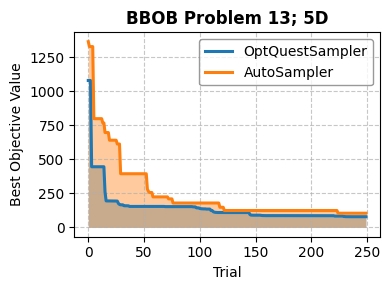
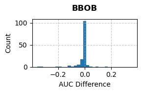
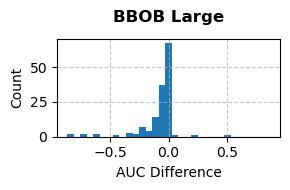
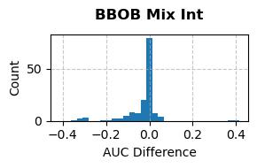
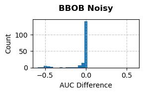
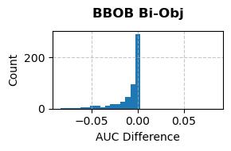
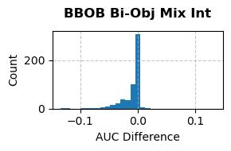
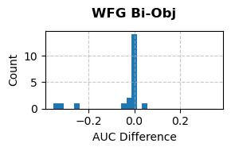
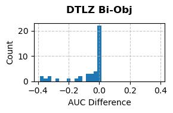
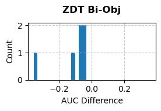

## Abstract

OptQuest developed by OptTek Systems, Inc. is a black-box solver that has been in development for over 30 years and has hundreds of thousands of licensed users across all industries. The OptQuest optimization engine implements black-box optimization through a metaheuristic framework that orchestrates multiple lower-level heuristics without relying on explicit problem formulations, gradients, or assumptions about convexity or smoothness. Metaheuristics operate as high-level, problem-independent strategies that dynamically combine and guide heuristics to balance exploration and exploitation in large search spaces: scatter search generates new candidates from combinations of elite solutions, tailored to variable types including continuous, integer, binary, discrete, categorical, and permutation; tabu search employs short- and long-term memory structures to avoid revisiting recent or poor regions and escape local optima; population-based approaches such as genetic algorithms evolve solution sets via fitness-based selection, recombination, and mutation; particle swarm optimization updates solution trajectories using velocity vectors influenced by personal and global bests with constriction for convergence; and surrogate models are constructed from evaluated points to predict and guide toward promising areas. OptQuest adapts these via phases: initialization (bounds, midpoints, design of experiments for sensitivities, potential linear programming(LP)/mixed integer programming(MIP) if linear structure is detected), diversification (biased quasi-random sampling to explore new regions), intensification (elite combinations for refinement), new best (pseudo-gradient or discrete moves for local search), and enumeration, while supporting mixed variables types, constraints, stochastic responses, and single- or multi-objective formulations optionally with goals.

## Commercial License

The OptQuest library can be used in conjunction with Optuna in demo/evaluation mode without a commercial license key. This mode is provided solely for testing, evaluation, and demonstration purposes. Any use in production environments, commercial deployments, or for generating results intended for business decision-making requires a valid commercial license key.

For licensing inquiries, purchasing a commercial license, obtaining a license key,  or requesting additional information, please contact:

OptTek Systems, Inc.

Email: info@opttek.com

Website: https://www.opttek.com/optquest/

## APIs

`OptQuestSampler(model=None, search_space=None, directions=None, seed=None, license='')`

- `model`: a fully defined OptQuestModel that defines the optimization. Mutually exclusive with the `search_space` and `directions` parameters.
- `search_space`: an Optuna search space dictionary defining the domain of the variables. If provided, `directions` must also be provided and `model` must not be provided.
- `directions`: a list of Optuna enums specifying the direction of each objective in the optimization. If provided, `search_space` must also be provided and `model` must not be provided.
- `seed`: random seed for the sampler.
- `license`: a license string for the underlying OptQuest engine. An empty string defaults to "demo" mode which is limited to 50 trials.

## Example

The OptQuest sampler can be used in one of two ways: The "Optuna way” uses Optuna primitives to define the search space and objective directions; the "OptQuest way” uses the full OptQuest API to define an optimization model with access to all of OptQuest's advanced features.

### The Optuna Approach

Creating the OptQuest sampler using the Optuna constructs is the easiest way to get started and the OptQuest sampler can be used as a drop-in replacement for any other Optuna sampler.

Like many samplers, the OptQuest engine needs to know the search space before the objective function is called as well as the directions of the objective(s).

```python
import optuna
import optunahub


OptQuestSampler = optunahub.load_module(package="samplers/optquest")


def objective(trial):
    x = trial.suggest_float("x", -5, 10)
    y = trial.suggest_float("y", -5, 10)
    return x**2 + y**2, (x - 5) * (x - 5) + (y - 5) * (y - 5)


search_space = {
    "x": optuna.distributions.FloatDistribution(-5, 10),
    "y": optuna.distributions.FloatDistribution(-5, 10),
}

directions = [optuna.study.StudyDirection.MINIMIZE, optuna.study.StudyDirection.MINIMIZE]

study = optuna.create_study(
    sampler=OptQuestSampler.OptQuestSampler(
        search_space=search_space, directions=directions, license=""
    ),
    directions=directions,
)

study.optimize(objective, n_trials=50)
```

### The OptQuest Approach

The OptQuest optimization model provides many more variable types than Optuna which can make an optimization more efficient. OptQuest also has an internal constraint processor that supports arbitrary constraints on inputs and outputs. By defining the model using OptQuest API, all of these features are available as a generic sampler.

The full OptQuest API documentation on creating models is located on our website: https://www.opttek.com/doc/v1000engine/OptQuest_Engine_Documentation/help.html

OptQuest was originally developed in a Simulation Optimization paradigm where a simulation has output metrics and the objective(s) are expressions based on the output metrics. To make that compatible with the Optuna approach, the OptQuest model needs to collect "outputs" from the Optuna objective function, and then OptQuest objectives are made from those outputs. In the example below, the outputs `out00` and `out01` are created to accept the two values returned from the Optuna objective function, and a separate OptQuest objective is made for each output. The order that the outputs are added to the model should match the order of the values returned by the Optuna objective function. See the OptQuest API documentation for details on more complex objective expressions.

```python
import optuna
import optunahub


OptQuestSampler = optunahub.load_module(package="samplers/optquest")


def objective(trial):
    x = trial.suggest_float("x", -5, 10)
    y = trial.suggest_float("y", -5, 10)
    return x**2 + y**2, (x - 5) * (x - 5) + (y - 5) * (y - 5)


directions = [optuna.study.StudyDirection.MINIMIZE, optuna.study.StudyDirection.MINIMIZE]

model = OptQuestSampler.OptQuestModel()
model.set_license("")
model.add_continuous_variable("x", -5, 10)
model.add_continuous_variable("y", -5, 10)

model.add_output_variable("out00")
model.add_output_variable("out01")
model.add_minimize_objective("obj00", "out00")
model.add_minimize_objective("obj01", "out01")

study = optuna.create_study(
    sampler=OptQuestSampler.OptQuestSampler(model=model), directions=directions
)

study.optimize(objective, n_trials=50)
```

#### OptQuest with Constraints

OptQuest supports arbitrary constraints on inputs and outputs. For constraints that are solely functions of inputs, OptQuest will never suggest a trial that violates constraints. For constraints that have outputs, OptQuest will track how badly constraints were violated to efficiently drive solutions to a feasible space. See the OptQuest API documentation for details on more complex constraint expressions.

```python
import optuna
import optunahub


OptQuestSampler = optunahub.load_module(package="samplers/optquest")


def objective(trial):
    x = trial.suggest_float("x", -5, 10)
    y = trial.suggest_float("y", -5, 10)
    return x**2 + y**2, (x - 5) * (x - 5) + (y - 5) * (y - 5)


directions = [optuna.study.StudyDirection.MINIMIZE, optuna.study.StudyDirection.MINIMIZE]

model = OptQuestSampler.OptQuestModel()
model.set_license("")
model.add_continuous_variable("x", -5, 10)
model.add_continuous_variable("y", -5, 10)

model.add_output_variable("out00")
model.add_output_variable("out01")
model.add_minimize_objective("obj00", "out00")
model.add_minimize_objective("obj01", "out01")

model.add_constraint("constraint1", "x < y+1")

study = optuna.create_study(
    sampler=OptQuestSampler.OptQuestSampler(model=model), directions=directions
)

study.optimize(objective, n_trials=50)
```

## Performance

Why use a commercial sampler with Optuna? Simply stated, we believe it's the best. Our optimization engine has been under continuous development for over 30 years, refined through feedback from countless real-world single- and multi-objective optimization problems. If the business problems you are using Optuna for involve critical real world applications and decisions where the speed of finding a great solution is important and the value of finding the best result is important you should try using OptQuest.

How do you quantify the quality of a sampler? We faced this challenge ourselves: when making changes to the OptQuest engine, how can we ensure robust, efficient, and effective performance across the diverse problems it might encounter? To address this, we've assembled thousands of real-world problems in our internal test suite and measure the performance of proposed updates using an "Area Under the Curve" (AUC) metric.

The AUC metric accounts for both solution quality (proximity to the best-known value) and convergence speed (how quickly the engine reaches that solution). Consider this example from the 5D Problem 13 in the Optuna BBOB test suite, where we plot the best-known solution (for a minimization objective) over 250 trials. For most of the optimization process, the OptQuestSampler identifies superior solutions more rapidly. By integrating the area under the curve of the best-known solution across trials, we derive a metric that captures how efficiently a sampler discovers high-quality solutions.



In practice, we normalize the trials to the interval \[0,1\] and the objective values to \[best-known, worst-known\] across both samplers. The resulting AUC ranges from 0 (ideal: best solution found on the first trial) to 1 (worst: no improvements ever occur). In this example, the OptQuestSampler achieves an AUC of 0.017, compared to 0.038 for the AutoSampler—roughly translating to a 2x performance advantage for OptQuestSampler.

Multi-objective optimizations are handled analogously: instead of tracking a single best-known solution per trial, we monitor the Pareto frontier and accumulate the undominated area (or hypervolume for many-objective cases). A lower AUC indicates earlier discovery of a stronger frontier.

We've detailed the rationale for this metric in our publication: Thengvall, B.G., Hall, S.N. & Deskevich, M.P. Measuring the effectiveness and efficiency of simulation optimization metaheuristic algorithms. *J Heuristics* **31**, 12 (2025). https://doi.org/10.1007/s10732-025-09549-2

Showing superior performance on a single problem is not conclusive, and no sampler will be uniformly better for all problems, so we aggregate AUC results across multiple problems and categories. A useful approach is to compute the AUC difference (OptQuestSampler AUC minus AutoSampler AUC) for each problem and analyze the distribution. Here, we show histograms of these differences for various Optuna test suites. Negative values indicate superior performance by the OptQuestSampler (implies smaller AUC, finding better solutions faster). For single-objective tests, we used 500 trials per run; for multi-objective tests, 5000.

| Test Suite                      | Functions    | Dimensions                    | AUC Difference Distribution                                                    |
| ------------------------------- | ------------ | ----------------------------- | ------------------------------------------------------------------------------ |
| BBOB                            | \[1..24\]    | \[2, 3, 5, 10, 20, 40\]       |                                          |
| BBOB Large Scale                | \[1..24\]    | \[20, 40, 80, 160, 320, 640\] |                   |
| BBOB Mixed Integer              | \[1..24\]    | \[5, 10, 20, 40, 80, 160\]    |                     |
| BBOB Noisy                      | \[101..130\] | \[2, 3, 5, 10, 20, 40\]       |                              |
| BBOB Bi-objective               | \[1..92\]    | \[2, 3, 5, 10, 20, 40\]       |                       |
| BBOB Bi-objective Mixed Integer | \[1..92\]    | \[5, 10, 20, 40, 80, 160\]    |  |
| WFG                             | \[1..7\]     | \[3,5,7\]                     |                                      |
| DLTZ                            | \[1..7\]     | \[3, 5, 7, 10, 13, 15\]       |                                    |
| ZDT                             | \[1..6\]     | n/a                           |                                      |

These results show superior performance in aggregate across problems of many different types in the Optuna test suite, specifically our unique approach to multi-objective problems. To see if OptQuest will provide superior performance on your critical real world problems request a trial license.

## A Deeper Dive into OptQuest: Optimization of Complex Systems

For many years approaches to optimizing complex systems were limited to creating simplified representations of the true systems that could be formulated as linear, integer, and nonlinear programs and solved with mathematical programming solvers. Custom heuristic optimization approaches for specific systems have also been developed on a case-by-case basis. Today, however, metaheuristic techniques have been developed that provide a powerful approach to building optimizers that can be applied as general solvers to solve arbitrarily complex problem formulations.

A model of a system for which inputs can be introduced, and resultant outputs can be collected, but for which there is no knowledge about the process that transforms inputs to outputs is commonly referred to as a “black box” model. Optimization approaches for black box models cannot assume any specific problem formulation or underlying problem structure. Black box models as a rule are not differentiable and have no assurance of a well-behaved response surface. Black box optimization involves optimizing complex system models without explicit mathematical formulations, relying on learning problem structure and responses from the results of iterative model evaluations of candidate solutions. This approach contrasts with context-dependent mathematical programming solvers which exploit specific formulations and specific model structure for efficiency. However, these requirements of mathematical programming approaches limit the scope of what can be modeled and hinder these models’ effectiveness to address many complex real-world problems.

Simulation modeling allows analysts to encode complex system logic and behaviors and enables examination of stochastic phenomena through Monte Carlo replications. General constructive simulation models are by nature black box models for which starting conditions and parameters can be specified and then the simulation can be executed to obtain one or more output metrics or responses. Traditional mathematical programming approaches cannot be used to find optimal inputs to optimize the responses from simulation models. Many artificial intelligence and machine learning (AI/ML) models are also black box models for which inputs can be transformed to outputs, but little is known or guaranteed about the underlying model structure or formulation.

Simulation optimization refers to approaches that integrate optimization algorithms with simulation models to find model inputs that maximize or minimize performance metrics. Optimizing arbitrary simulation or AI/ML models requires a black box optimization approach because no analytical gradients are available and no problem structure is known. The only thing available is iterative feedback on performance metrics that can be obtained by running the model with different input values. Creating a robust and effective general simulation optimizer is an extremely challenging problem because model evaluations can be computationally expensive and response surfaces are often non-convex and may not even be contiguous. For more than a handful of inputs being varied an enumeration approach quickly becomes inefficient or intractable. Parametric sweeps and design of experiments approaches can provide general sensitivities and response surface contours, but these approaches are limited by sampling resolution and rarely identify optimal outcomes because there is no learning from successive model evaluations. An intelligent search is needed that does not get trapped in local optima and can efficiently identify the best solutions.

Since 1998, OptQuest, developed by OptTek Systems, Inc., has been the leader in black-box optimization software for simulation models and other complex systems. The OptQuest software is based around metaheuristic approaches to efficiently and effectively find optimal solutions.

OptQuest embeds a sophisticated metaheuristic that is a high-level, problem-independent, algorithmic approach that combines and guides multiple heuristic, machine learning, and mathematical programming techniques to form a robust and effective higher-level optimization algorithm. It provides strategies for exploring solution spaces efficiently that rapidly identify very good or optimal solutions. Metaheuristics are inherently heuristic, yielding "good enough" solutions in "small enough" time, unlike exact methods that prove optimality for smaller problems but suffer combinatorial explosion and extensive solution times for larger NP-hard problems. Metaheuristics avoid exhaustive enumeration, relying on a mix of sampling, exploiting local information, and memory structures to navigate large spaces. Metaheuristics offer superior flexibility over exact methods. They adapt to varying solution quality needs and computing budgets across problems, without demanding strict mathematical formulations or specific constraints. This makes a metaheuristic approach well suited to optimizing simulation and AI/ML models and solving real-life problems.

Simulation optimization of complex systems often entails models that are stochastic, non-linear, non-continuous, non-smooth and expensive to evaluate; however, some models are well-behaved and can be solved more easily. OptTek’s OptQuest solver embeds a sophisticated optimization approach that has been refined and improved for more than 25 years to analyze the results of the model evaluations and quickly choose the correct approach for efficient optimization. If a model appears to be linear, the linear solver will rapidly identify the optimal solution; if a model appears to be smooth, a pseudo-gradient descent approach will be used; real world models often have their optimum “near the middle” or “out at the edges” and OptQuest explores these areas to find potential early-exit cases. That is, OptQuest identifies and exploits structure found in each model and applies different combinations of heuristic, machine learning, and mathematical programming techniques based on the problem structure and the progress of the optimization search process, making it a robust and adaptive solver for any kind of optimization.

OptQuest iterates through various phases during an optimization run based on the problem structure and the progress of the search. In the Initialization phase, OptQuest looks to find early good or optimal solutions based on the typical structure of real-world models. Following the Initialization phase, OptQuest alternates between Diversification and Intensification phases. In Diversification phases OptQuest explores broadly and evaluates solutions that are spread out across the search domain to understand overall response patterns. This can lead to finding very good solutions rapidly and ensures that OptQuest does not get trapped in or remain in a local optimum. In Intensification phases OptQuest searches for progressively better solutions in areas where relatively good solutions have been discovered. A New Best phase is initiated when a new best solution is found in which additional heuristics are used to exploit the local neighborhood structure of the new best result. An Enumeration phase may be entered in which OptQuest will exhaustively enumerate remaining valid solutions if all other phases are not making progress.

OptQuest supports single and multi-objective optimization. During multi-objective optimization, OptQuest alternates between single-objective searches to find the optimal for each individual objective, and a gap-filling phase where the gaps in the current frontier are targeted for exploitation to build the frontier of tradeoffs between multiple objectives.

**Initialization**. In the Initialization phase, OptQuest collects initial information about the model and response patterns. Initial solutions at variable bounds and midpoints are explored. If the model happens to be linear (a linear objective function with only linear constraints), OptQuest will use an internal linear program (LP) or mixed-integer problem (MIP) solver and return immediately with an optimal or near-optimal answer. For constrained problems, OptQuest will initially explore the edges and middle of the constrained domain to search in typical regions where real-world problems often have optima. A design of experiments may be created and evaluated to identify general response patterns and variable sensitivities over the search space. This information can be used to warm-start the optimization search.

**Diversification**. To prevent getting stuck in local optima, OptQuest will periodically transition to a diversification phase. Here, the domain is searched quasi-randomly, slowly increasing in density to find good regions that have not been searched yet. The best solutions found during diversification are then refined during the intensification phase. Diversification is informed by previous exploration by implementing a pseudo-particle-swarm approach that is optimized for expensive evaluations and large dimensional space to generate new, diverse solutions slightly biased towards known good regions.

**Intensification**. In the intensification phase OptQuest works to turn good solutions into better solutions. Concepts related to scatter search underpin many of the heuristics used in the intensification phase where a local population of good solutions are combined in different ways to search for better solutions. There are special implementations of these combination algorithms to deal with different types of input values including binary, integer, continuous, discrete, categorical, and permutation variables. During combinations, if a key vector in the space is discovered to produce improving solutions, OptQuest will make larger jumps towards the edges of the constrained space to quicky find boundary cases that may be optimal.

During the multi-objective gap-filling phase, intensification combinations are created using frontier and near-frontier points with the goal of pushing the frontier out into the non-dominated space as quickly as possible.

A key feature of the diversification and intensification phases is the incorporation of ideas from Tabu search, where memory structures are used to recognize and avoid getting stuck in local optima and ensure the algorithm finds global optima. Once a region stops producing improving solutions, OptQuest will revert to the diversification phase to search broadly and find new better solutions.

**New Best**. During diversification or intensification phases if a new best solution is found, OptQuest will enter a New Best phase. In this phase OptQuest will use pseudo-gradient or other local search information to find even better solutions in the newly identified best region. Once this phase stops producing improving solutions, OptQuest will return to diversification and intensification.

**Enumeration**. If OptQuest is given a pathological problem, or a very highly constrained problem, or a problem with a very small domain of possible solutions for which the corpus of metaheuristic approaches fails to create new solutions to evaluate, it will resort to simple enumeration. In this terminal phase, OptQuest will iterate through the search domain and enumerate all possible solutions.

OptQuest uses a proprietary knowledge-based AI system to determine when to switch phases and what metaheuristics to deploy in each phase. Depending on the nature of the problem and the progress of the search, solutions are generated by different combinations of the following algorithms at different phases of the search process:

- **Linear, Integer, and Non-linear Programming**. For LP, MIP, NLP problems, internal mathematical programing approaches are used to find a provably optimal solution.

- **Design of Experiments**. Various design of experiments approaches are available to perform initial model evaluations to understand response surface shape and variable sensitivities.

- **Hypercube Diagonal**. A set of solutions are generated along the diagonal of the hypercube of the tradespace from all min values up to all max values for each variable.

- **Zero**. Often in real world applications, the optimal solution will appear when all of the variables are at or near zero. The “zero solution” may be used during the initialization phase.

- **Nelder-Mead**. The Nelder-Mead algorithm is a classic method to search when gradients aren’t available. It is not efficient enough for frequent use in OptQuest, however it may be used when the traditional Initialization phase does not find many feasible starting solutions. Existing infeasible solutions will be mapped into a feasible space by utilizing a variant of the classic Nelder-Mead simplex approach.

- **Populate**. The main algorithm used during the diversification phase uses a biased quasi-random sequence to new areas of the domain with increasing density with a particle-swam-like bias towards the good regions.

- **Combination**. The main algorithm used during the intensification phase creates different kinds of linear combinations based on a local population of elite solutions. Special cases of the algorithm exist to handle all types of input variables and problem constraints.

- **Boundary**. When the combination algorithm consistently finds new solutions along a vector, this algorithm will speed up the search by jumping to the edge of the constrained problem or variable space along that vector.

- **Cross Entropy Method**. This algorithm will bias solution generation using probability distributions based on the best values in the collection of best found solutions.

- **Swap**. When multiple variables of the same type are detected to have similar effects, this algorithm will look for ways to swap the variables to find a better ordering.

- **Regression**. If the model shows near-linear behavior, this algorithm will create a high-dimensional regression model to estimate regions where optimality is likely.

- **Pseudo-Gradient Descent**. When new best solutions are found close together, a pseudo-gradient can be estimated and Newtown-Raphson-like steps are taken to walk towards a local optimum.

- **Discrete Move**. This algorithm is a special case of Pseudo-Gradient Descent that works well for problems with discrete variables.

- **Enumeration**. The last resort algorithm if the other algorithms fail to generate new high-quality solutions.

- **Surrogate Model Optimization**. As elite solutions are generated, a non-linear, continuous, and smooth surrogate model is created in the background. Periodically, the optimum is found on the surrogate model and used as a starting point for the evaluation.

- **Genetic Algorithm.** A genetic algorithmic framework in which a population of solutions is evolved over time by creating a sequence of generations where the fitness (i.e., objective function value) of the individual solutions is used for the selection, recombination and survival processes.

- **Particle Swarm.** A swarm (population) of particles (solutions) is generated either at random or through design of experiments. A velocity vector is randomly created for each particle and is repeatedly updated during the evolution process to guide the search trajectory of the particle. The update is formula driven and includes cognitive coefficients, random elements and a constriction coefficient to ensure the convergence of the algorithm.
