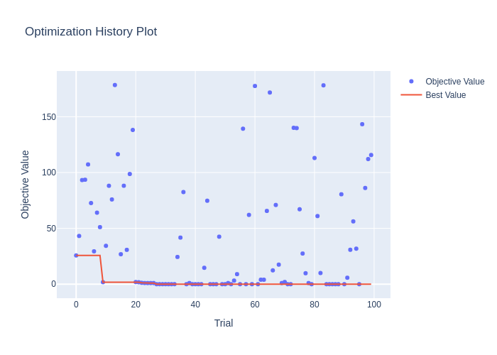

## APIs

A sampler that uses SMAC3 v2.2.0.

Please check the API reference for more details:

- https://automl.github.io/SMAC3/main/5_api.html

### `SMACSampler(search_space: dict[str, BaseDistribution], n_trials: int = 100, seed: int | None = None, *, surrogate_model_type: str = "rf", acq_func_type: str = "ei_log", init_design_type: str = "sobol", surrogate_model_rf_num_trees: int = 10, surrogate_model_rf_ratio_features: float = 1.0, surrogate_model_rf_min_samples_split: int = 2, surrogate_model_rf_min_samples_leaf: int = 1, init_design_n_configs: int | None = None, init_design_n_configs_per_hyperparameter: int = 10, init_design_max_ratio: float = 0.25, output_directory: Path = Path("smac3_output"))`

- `search_space`: A dictionary of Optuna distributions.
- `n_trials`: Number of trials to be evaluated in a study. This argument is used to determine the number of initial configurations by SMAC3. Use at most `n_trials * init_design_max_ratio` number of configurations in the initial design. This argument does not have to be precise, but it is better to be exact for better performance.
- `seed`: Seed for random number generator. If `None` is given, seed is generated randomly.
- `surrogate_model_type`: What model to use for the probabilistic model. Either `"gp"` (Gaussian process), `"gp_mcmc"` (Gaussian process with MCMC), or `"rf"` (random forest). Default to `"rf"` (random forest).
- `acq_func_type`: What acquisition function to use. Either `"ei"` (expected improvement), `"ei_log"` (expected improvement with log-scaled function), `"pi"` (probability of improvement), or `"lcb"` (lower confidence bound). Default to `"ei_log"`.
- `init_design_type`: What initialization sampler to use. Either `"sobol"` (Sobol sequence), `"lhd"` (Latin hypercube), or `"random"`. Default to `"sobol"`.
- `surrogate_model_rf_num_trees`: The number of trees used for random forest. Equivalent to `n_estimators` in `RandomForestRegressor` in sklearn.
- `surrogate_model_rf_ratio_features`: The ratio of features to use for each tree training in random forest. Equivalent to `max_features` in `RandomForestRegressor` in sklearn.
- `surrogate_model_rf_min_samples_split`: The minimum number of samples required to split an internal node: Equivalent to `min_samples_split` in `RandomForestRegressor` in sklearn.
- `surrogate_model_rf_min_samples_leaf`: The minimum number of samples required to be at a leaf node. A split point at any depth will only be considered if it leaves at least `min_samples_leaf` training samples in each of the left and right branches. This may have the effect of smoothing the model, especially in regression. Equivalent to `min_samples_leaf` in `RandomForestRegressor` in sklearn.
- `init_design_n_configs`: Number of initial configurations.
- `init_design_n_configs_per_hyperparameter`: Number of initial configurations per hyperparameter. For example, if my configuration space covers five hyperparameters and `n_configs_per_hyperparameter` is set to 10, then 50 initial configurations will be sampled.
- `init_design_max_ratio`: Use at most `n_trials * init_design_max_ratio` number of configurations in the initial design. Additional configurations are not affected by this parameter.
  `output_directy` : `Path`, defaults to `Path("smac3_output")`. The directory in which to save the output. The files are saved in `./output_directory/name/seed`.

## Installation

```bash
pip install -r https://hub.optuna.org/samplers/smac_sampler/requirements.txt
```

## Example

```python
import optuna
import optunahub


module = optunahub.load_module("samplers/smac_sampler")
SMACSampler = module.SMACSampler


def objective(trial: optuna.trial.Trial) -> float:
    x = trial.suggest_float("x", -10, 10)
    y = trial.suggest_int("y", -10, 10)
    return x**2 + y**2


n_trials = 100
sampler = SMACSampler(
    {
        "x": optuna.distributions.FloatDistribution(-10, 10),
        "y": optuna.distributions.IntDistribution(-10, 10),
    },
    n_trials=n_trials,
    output_directory="smac3_output",
)
study = optuna.create_study(sampler=sampler)
study.optimize(objective, n_trials=n_trials)
print(study.best_trial.params)
```

See [`example.py`](https://github.com/optuna/optunahub-registry/blob/main/package/samplers/smac_sampler/example.py) for a full example.


## Others

SMAC is maintained by the SMAC team in [automl.org](https://www.automl.org/). If you have trouble using SMAC, a concrete question or found a bug, please create an issue under the [SMAC](https://github.com/automl/SMAC3) repository.

For all other inquiries, please write an email to smac\[at\]ai\[dot\]uni\[dash\]hannover\[dot\]de.

### Reference

Lindauer et al. "SMAC3: A Versatile Bayesian Optimization Package for Hyperparameter Optimization", Journal of Machine Learning Research, http://jmlr.org/papers/v23/21-0888.html
