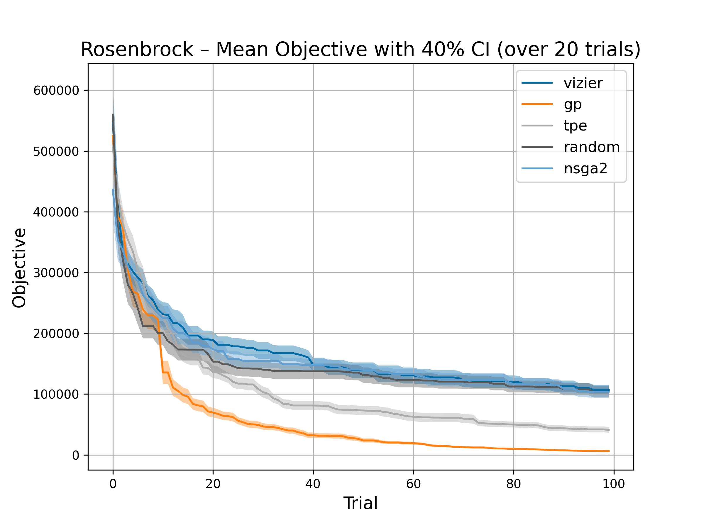
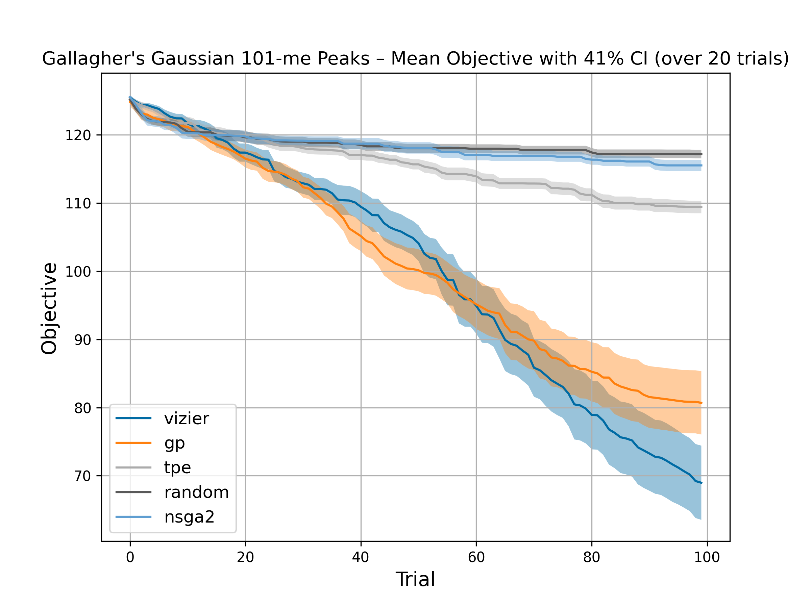
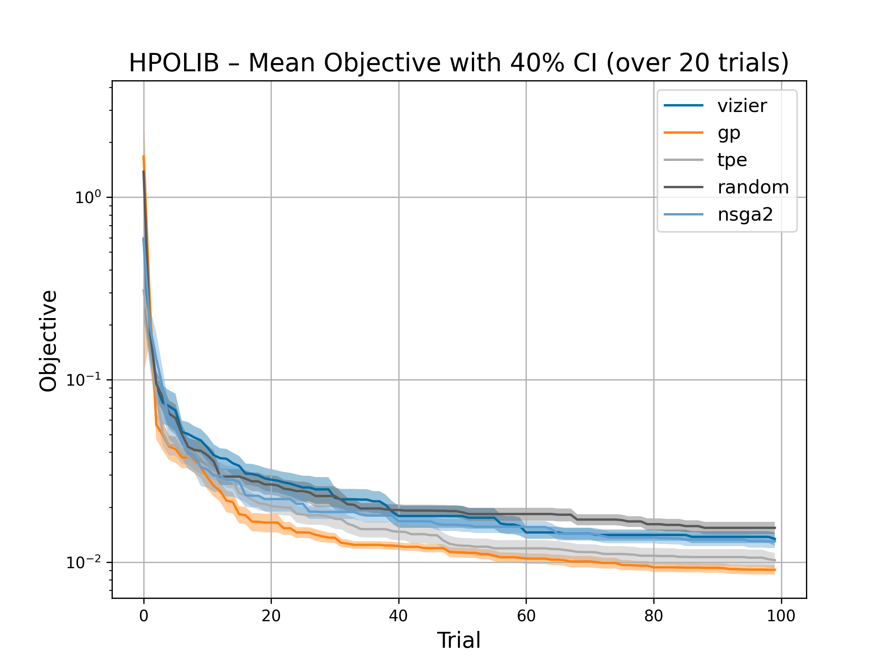
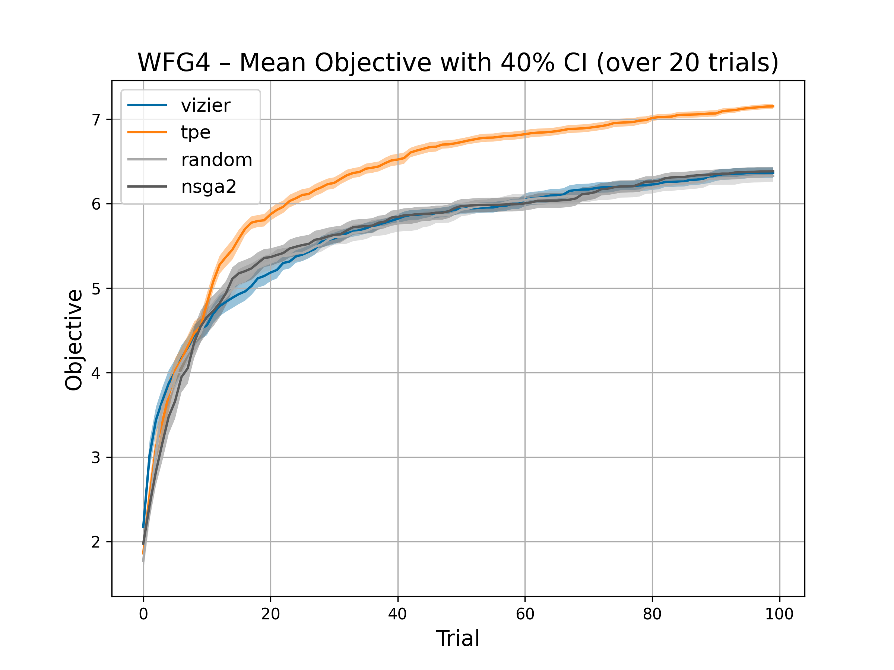
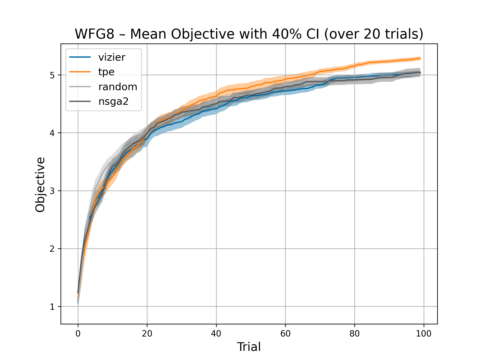

## Abstract

This package provides a sampler using Google Vizier.
It is a simple wrapper around Vizier's Python client, enabling its optimization capabilities within the Optuna framework.

## Class or Function Names

- VizierSampler

## Example

```python
import optuna
from optuna.visualization import plot_hypervolume_history
import optunahub


wfg = optunahub.load_module("benchmarks/wfg")
wfg4 = wfg.Problem(function_id=4, n_objectives=2, dimension=5, k=1)


vizier = optunahub.load_module("samplers/vizier")

study = optuna.create_study(
    study_name="Vizier",
    sampler=vizier.VizierSampler(search_space=wfg4.search_space),
    directions=wfg4.directions,
)
study.optimize(wfg4, n_trials=100)

plot_hypervolume_history(study, reference_point=[0.5, 0.5])
```

## Benchmarks

Following images are the benchmark of Vizier and other samplers.






