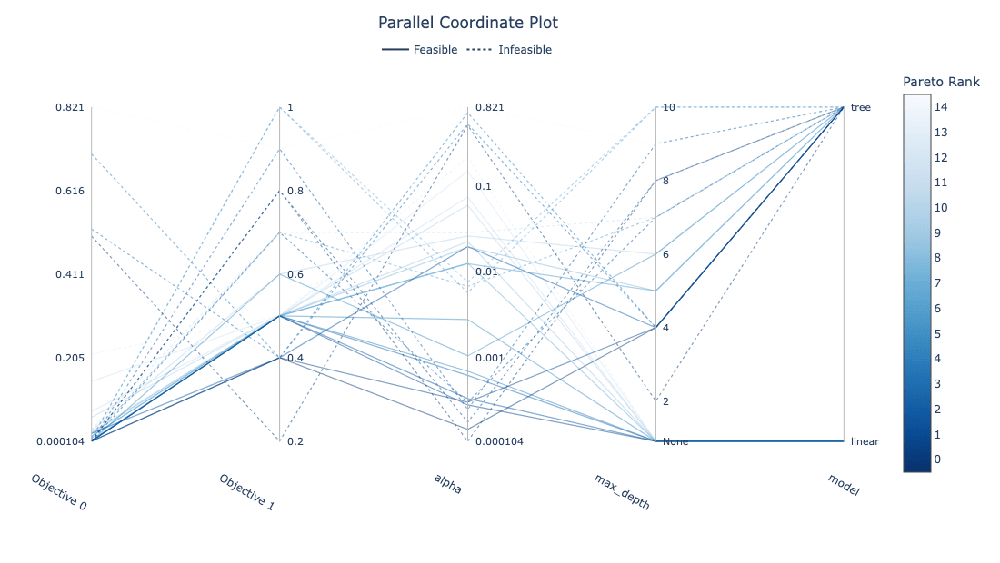
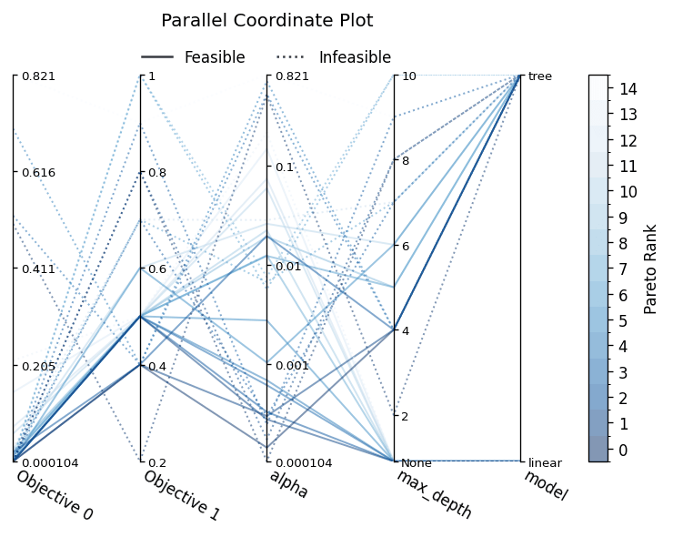

## Abstract

This package provides a parallel coordinate plot for Optuna studies. It follows Optuna's visualization module layout: `plot_parallel_coordinate` returns a Plotly figure, and `matplotlib.plot_parallel_coordinate` returns a Matplotlib axes object.

The current implementation adds:

- Conditional parameter support: if a trial does not contain a selected parameter, the line is connected to a special `None` tick below the valid values.
- Multi-objective support: objective axes are shown side by side, and trial colors are ordered by Pareto rank.
- Constrained optimization support: infeasible trials are shown with dotted lines.

For constrained multi-objective studies, Pareto ranks are computed from objective values only. Constraint information is used only to change the line style: feasible trials are shown with solid lines, and infeasible trials are shown with dotted lines. Trials without constraint information are treated as feasible.

## APIs

- `plot_parallel_coordinate(study, params=None, *, target=None, target_name="Objective Value", objective_names=None, missing_label="None")`
  - Returns a `plotly.graph_objects.Figure`.
  - `study`: An `optuna.Study` object.
  - `params`: Optional parameter names to visualize. By default, all parameters observed in completed trials are used.
  - `target`: Optional target function. If set, this is used as a single target even for multi-objective studies.
  - `target_name`: Axis and colorbar label for a single target.
  - `objective_names`: Optional labels for multi-objective axes.
  - `missing_label`: Label for parameters missing from a trial. The default is `"None"`.
- `matplotlib.plot_parallel_coordinate(study, params=None, *, target=None, target_name="Objective Value", objective_names=None, missing_label="None")`
  - Returns a `matplotlib.axes.Axes`.
  - `study`: An `optuna.Study` object.
  - `params`: Optional parameter names to visualize. By default, all parameters observed in completed trials are used.
  - `target`: Optional target function. If set, this is used as a single target even for multi-objective studies.
  - `target_name`: Axis and colorbar label for a single target.
  - `objective_names`: Optional labels for multi-objective axes.
  - `missing_label`: Label for parameters missing from a trial. The default is `"None"`.

## Installation

```shell
$ pip install plotly matplotlib numpy
```

## Example

```python
import optuna
import optunahub


def objective(trial):
    model = trial.suggest_categorical("model", ["linear", "tree"])
    alpha = trial.suggest_float("alpha", 1e-4, 1.0, log=True)
    if model == "tree":
        max_depth = trial.suggest_int("max_depth", 2, 10)
        return alpha, max_depth / 10
    return alpha, 0.5


def constraints(trial):
    depth = trial.params.get("max_depth", 5) / 10
    return (trial.params["alpha"] + depth - 0.7,)


sampler = optuna.samplers.NSGAIISampler(constraints_func=constraints, seed=0)
study = optuna.create_study(directions=["minimize", "minimize"], sampler=sampler)
study.optimize(objective, n_trials=30)

module = optunahub.load_module(package="visualization/extended_pcp")
fig = module.plot_parallel_coordinate(study)
fig.show()
```



### Matplotlib

```python
import matplotlib.pyplot as plt

ax = module.matplotlib.plot_parallel_coordinate(study)
plt.show()
```


