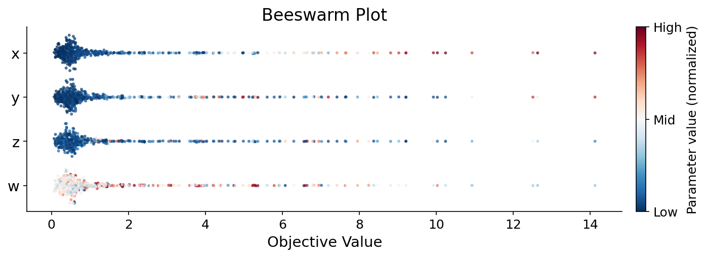

## Class or Function Names

- `plot_beeswarm(study, *, params=None, target=None, target_name="Objective Value", color_map="RdBu_r", ax=None)`

  - `study`: An Optuna study with completed trials.
  - `params`: A list of parameter names to include. If `None`, all parameters across completed trials are used.
  - `target`: A callable that extracts a scalar value from a `FrozenTrial`. Defaults to `trial.value`.
  - `target_name`: Label for the x-axis. Defaults to `"Objective Value"`.
  - `color_map`: Matplotlib colormap name. Defaults to `"RdBu_r"` (blue for low, red for high).
  - `ax`: Matplotlib axes to draw on. If `None`, a new figure is created.
  - **Returns**: A tuple of `(figure, axes, colorbar)`.

## Example

```python
import optuna
import optunahub

mod = optunahub.load_module(package="visualization/plot_beeswarm")
plot_beeswarm = mod.plot_beeswarm


def objective(trial: optuna.trial.Trial) -> float:
    x = trial.suggest_float("x", 0.0, 10.0)
    y = trial.suggest_float("y", 0.0, 10.0)
    z = trial.suggest_float("z", 0.0, 10.0)
    w = trial.suggest_float("w", 0.0, 10.0)
    return 1.0 * x + 0.5 * y + 0.1 * z + 0.01 * w


study = optuna.create_study()
study.optimize(objective, n_trials=500)

fig, ax, cbar = plot_beeswarm(study)
```



## How It Works

Each row in the plot represents a hyperparameter. Each dot is one trial:

- **X-axis**: Objective function value
- **Y-axis**: Parameter (rows), sorted by correlation with the objective (most important at top)
- **Color**: Normalized parameter value (blue = low, red = high)
- **Vertical spread**: Density-based jitter — wider where trials are concentrated

This makes it easy to spot monotonic relationships (e.g., "higher x leads to higher objective") at a glance.

## References

- Inspired by [SHAP beeswarm plots](https://shap.readthedocs.io/en/latest/example_notebooks/api_examples/plots/beeswarm.html)
- Original feature request: [optuna/optuna#4987](https://github.com/optuna/optuna/issues/4987)
