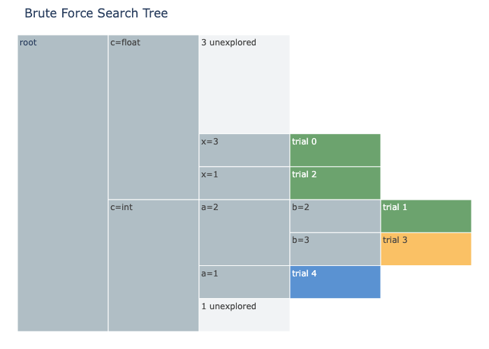

## Abstract

`optuna.samplers.BruteForceSampler` explores a define-by-run search space as a tree: each
internal node is a parameter, and a path from the root to a leaf is one trial's complete
`params`. This package renders that tree as an interactive
[icicle chart](https://plotly.com/python/icicle-charts/), so you can see which branches have
been sampled, how each trial's parameters relate to one another, and how much of a finite
(grid-like) search space is still unexplored.



Leaves are colored by trial state (complete/pruned/failed/running); hovering over a complete
trial's leaf shows its objective value(s). A synthetic `... unexplored` leaf is added under every
branching point that still has unvisited candidate values.

## APIs

### `plot_brute_force_tree(study)`

- `study` (`optuna.Study`): A study, ideally optimized with `BruteForceSampler`. Any study
  works, but the "unexplored" counts are only meaningful for finite, grid-like search spaces
  (e.g. `IntDistribution` or `FloatDistribution` with `step` set, or `CategoricalDistribution`).

Returns a `plotly.graph_objects.Figure`.

## Example

```python
import optuna
import optunahub


module = optunahub.load_module("visualization/plot_brute_force_tree")


def objective(trial: optuna.Trial) -> float:
    c = trial.suggest_categorical("c", ["float", "int"])
    if c == "float":
        return trial.suggest_float("x", 1, 3, step=0.5)
    else:
        a = trial.suggest_int("a", 1, 3)
        b = trial.suggest_int("b", a, 3)
        return a + b


study = optuna.create_study(sampler=optuna.samplers.BruteForceSampler(seed=42))
study.optimize(objective, n_trials=30)

fig = module.plot_brute_force_tree(study)
fig.show()
```

## Others

This package only reads public `optuna.trial.FrozenTrial` fields (`params`, `distributions`,
`state`, `values`), so it does not depend on `BruteForceSampler`'s private tree implementation
and works across Optuna versions.
