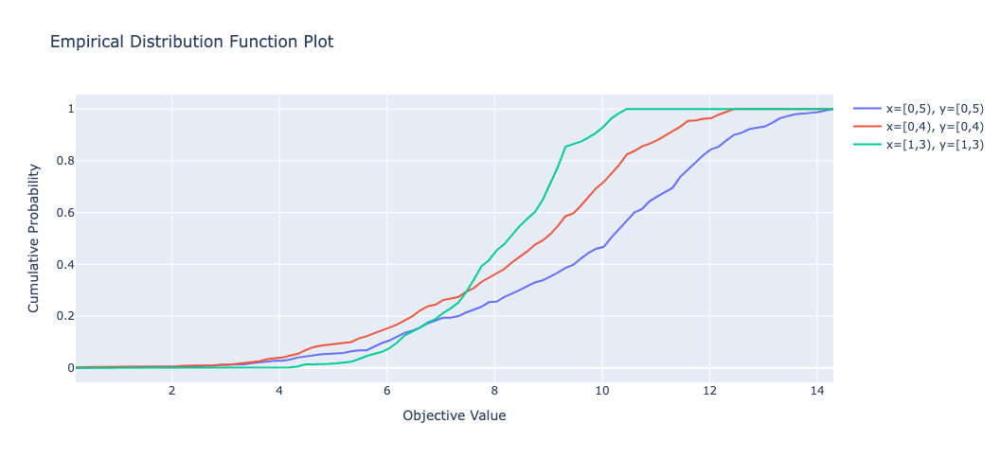

## Class or Function Names
- plot_edf

## Example
```python
from optuna.visualization import plot_edf
plot_edf(study)
```



## Others
See the [documentation](https://optuna.readthedocs.io/en/stable/reference/visualization/generated/optuna.visualization.plot_edf.html) for more details.
