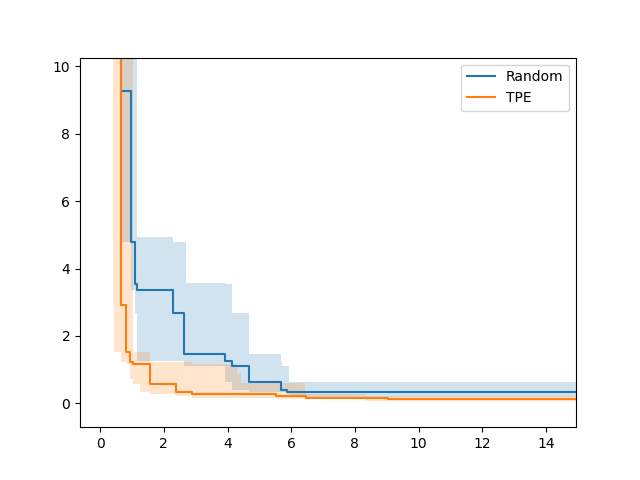

## Abstract

Hyperparameter optimization is crucial to achieving high performance in deep learning.
On top of the performance, other criteria such as inference time or memory requirement often need to be optimized due to some practical reasons.
This motivates research on multi-objective optimization (MOO).
However, Pareto fronts of MOO methods are often shown without considering the variability caused by random seeds, making the performance stability evaluation difficult.
This package provides empirical attainment surface implementation based on [the original implementation](https://github.com/nabenabe0928/empirical-attainment-func).

The details of empirical attainment surface are available in [`Python Tool for Visualizing Variability of Pareto Fronts over Multiple Runs`](https://arxiv.org/abs/2305.08852).



## APIs

- `plot_empirical_attainment_surface(study_list: list[optuna.Study], attainment_ratios: list[int], ax: plt.Axes | None = None, color: str | None = None, label: str | None = None, linestyle: str | None = None, marker: str | None = None, log_scale_inds: list[int] | None = None, **ax_plot_kwargs)`
  - `study_list`: A list of studies used for the uncertainty visualization of the attainment surface.
  - `attainment_ratios`: The ratios of studies that need to dominate the surface. The length must be either 1 or 3. If the length is 1, the corresponding attainment surface will be visualized. If the length is 3, the area between the attainment surfaces with the lowest and the highest ratios will be visualized as the uncertainty.
  - `ax`: The axes of Matplotlib.
  - `color`: The color of the empirical attainment surface.
  - `label`: The label of the empirical attainment surface.
  - `linestyle`: The line style of the empirical attainment surface.
  - `marker`: The marker of the empirical attainment surface.
  - `log_scale_inds`: The indices of values that should be in the log scale. Either 0 or 1 can be specified.
  - `**ax_plot_kwargs`: The `kwargs` input to `ax.plot`.
- `plot_multiple_empirical_attainment_surfaces(multiple_study_list: list[list[optuna.Study]], attainment_ratios: list[int], ax: plt.Axes | None = None, colors: list[str] | None = None, labels: list[str] | None = None, linestyles: list[str] | None = None, markers: list[str] | None = None, log_scale_inds: list[int] | None = None, **ax_plot_kwargs)`
  - `multiple_study_list`: A list of study list used for the uncertainty visualization of each attainment surface.
  - `attainment_ratios`: The ratios of studies that need to dominate the surface. The length must be either 1 or 3. If the length is 1, the corresponding attainment surface will be visualized. If the length is 3, the area between the attainment surfaces with the lowest and the highest ratios will be visualized as the uncertainty.
  - `ax`: The axes of Matplotlib.
  - `colors`: A list of the color of each empirical attainment surface.
  - `labels`: A list of the label of each empirical attainment surface.
  - `linestyles`: A list of the line style of each empirical attainment surface.
  - `markers`: A list of the marker of each empirical attainment surface.
  - `log_scale_inds`: The indices of values that should be in the log scale. Either 0 or 1 can be specified.
  - `**ax_plot_kwargs`: The `kwargs` input to `ax.plot`.

A typical `attainment_ratios` is `[0.25, 0.5, 0.75]` for the uncertainty visualization and `[0.5]` for the representative Pareto front.

## Installation

```shell
$ pip install optuna matplotlib
```

## Example

**Example**

```python
from __future__ import annotations

import matplotlib.pyplot as plt
import optuna
import optunahub


def objective(trial: optuna.Trial) -> tuple[float, float]:
    x = trial.suggest_float("x", -5, 5)
    y = trial.suggest_float("y", -5, 5)
    return x**2 + y**2, (x - 2)**2 + (y - 2)**2

multiple_study_list = []
for sampler_cls in [optuna.samplers.RandomSampler, optuna.samplers.TPESampler]:
    study_list = []
    for seed in range(10):
        sampler = sampler_cls(seed=seed)
        study = optuna.create_study(directions=["minimize", "minimize"], sampler=sampler)
        study.optimize(objective, n_trials=50)
        study_list.append(study)
    multiple_study_list.append(study_list)

plot_multiple_empirical_attainment_surfaces = optunahub.load_module(
    "visualization/plot_empirical_attainment_surface"
).plot_multiple_empirical_attainment_surfaces
ax = plot_multiple_empirical_attainment_surfaces(
    multiple_study_list, attainment_ratios=[0.25, 0.5, 0.75], labels=["Random", "TPE"]
)
plt.show()
```

## Others

### Bibtex

Please cite [our paper](https://arxiv.org/abs/2305.08852), when using this module.

```bibtex
@article{watanabe2023python,
  title={{P}ython tool for visualizing variability of {P}areto fronts over multiple runs},
  author={Watanabe, Shuhei},
  journal={arXiv preprint arXiv:2305.08852},
  year={2023}
}
```
