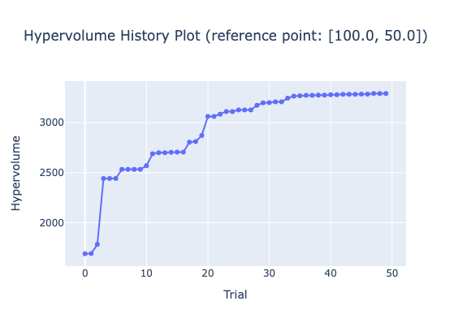

## Class or Function Names
- plot_hypervolume_history

## Example
```python
mod = optunahub.load_module("visualization/plot_hypervolume_history_with_rp")
mod.plot_hypervolume_history(study, reference_point)
```
See [`example.py`](https://github.com/optuna/optunahub-registry/blob/main/package/visualization/plot_hypervolume_history_with_rp/example.py) for more details.
The example of generated image is as follows.


