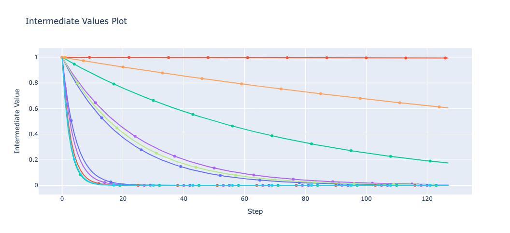

## Class or Function Names

- plot_intermediate_values

## Example

```python
from optuna.visualization import plot_intermediate_values
plot_intermediate_values(study)
```



## Others

See the [documentation](https://optuna.readthedocs.io/en/stable/reference/visualization/generated/optuna.visualization.plot_intermediate_values.html) for more details.
