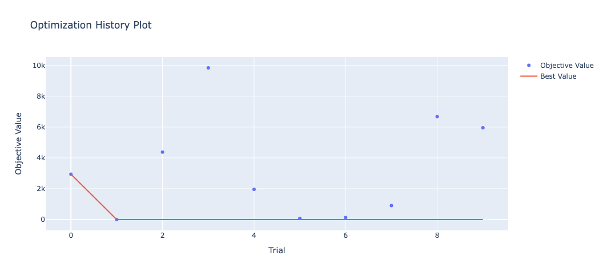

## Class or Function Names
- plot_optimization_history

## Example
```python
from optuna.visualization import plot_optimization_history
plot_optimization_history(study)
```



## Others
See the [documentation](https://optuna.readthedocs.io/en/stable/reference/visualization/generated/optuna.visualization.plot_optimization_history.html) for more details.
