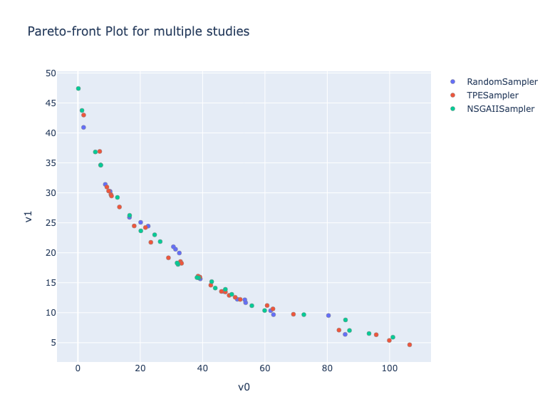

## Class or Function Names

- plot_pareto_front

## Example

```python
import optuna
import optunahub


def objective(trial: optuna.Trial) -> tuple[float, float]:
    x = trial.suggest_float("x", 0, 5)
    y = trial.suggest_float("y", 0, 3)

    v0 = 4 * x**2 + 4 * y**2
    v1 = (x - 5) ** 2 + (y - 5) ** 2
    return v0, v1


samplers = [
    optuna.samplers.RandomSampler(),
    optuna.samplers.TPESampler(),
    optuna.samplers.NSGAIISampler(),
]
studies = []
for sampler in samplers:
    study = optuna.create_study(
        sampler=sampler,
        study_name=f"{sampler.__class__.__name__}",
        directions=["minimize", "minimize"],
    )
    study.optimize(objective, n_trials=50)
    studies.append(study)

m = optunahub.load_module(
    "visualization/plot_pareto_front_multi"
)
fig = m.plot_pareto_front(studies)
fig.show()
```


