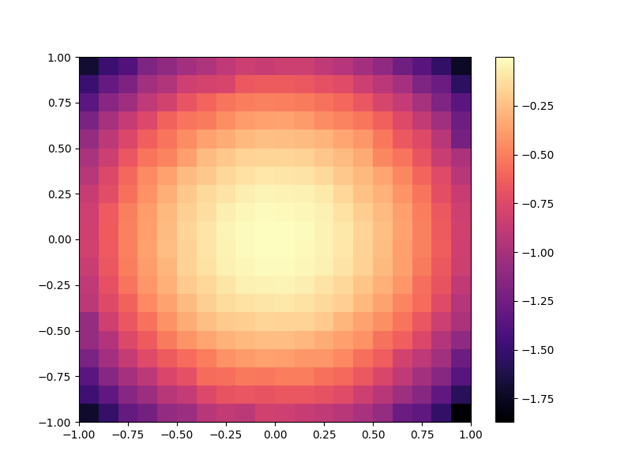

## Class or Function Names

- `plot_grid_archive_heatmap(study: optuna.Study, ax: plt.Axes, **kwargs)`

  - `study`: Optuna study with a sampler that uses pyribs. This function will plot the result archive from the sampler's scheduler.
  - `ax`: Axes on which to plot the heatmap. If None, we retrieve the current axes.
  - `**kwargs`: All remaining kwargs will be passed to [`grid_archive_heatmap`](https://docs.pyribs.org/en/stable/api/ribs.visualize.grid_archive_heatmap.html).

## Installation

```shell
$ pip install ribs[visualize]
```

## Example

A minimal example would be the following:

```python
import matplotlib.pyplot as plt
import optuna
import optunahub

module = optunahub.load_module("samplers/cmamae")
CmaMaeSampler = module.CmaMaeSampler

plot_pyribs = optunahub.load_module(package="visualization/plot_pyribs")
plot_grid_archive_heatmap = plot_pyribs.plot_grid_archive_heatmap


def objective(trial: optuna.trial.Trial) -> float:
    """Returns an objective followed by two measures."""
    x = trial.suggest_float("x", -10, 10)
    y = trial.suggest_float("y", -10, 10)
    trial.set_user_attr("m0", 2 * x)
    trial.set_user_attr("m1", x + y)
    return x**2 + y**2


if __name__ == "__main__":
    sampler = CmaMaeSampler(
        param_names=["x", "y"],
        measure_names=["m0", "m1"],
        archive_dims=[20, 20],
        archive_ranges=[(-1, 1), (-1, 1)],
        archive_learning_rate=0.1,
        archive_threshold_min=-10,
        n_emitters=1,
        emitter_x0={
            "x": 0,
            "y": 0,
        },
        emitter_sigma0=0.1,
        emitter_batch_size=20,
    )
    study = optuna.create_study(sampler=sampler)
    study.optimize(objective, n_trials=10000)

    fig, ax = plt.subplots(figsize=(8, 6))
    plot_grid_archive_heatmap(study, ax=ax)
    plt.savefig("archive.png")
    plt.show()
```


