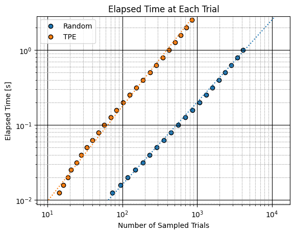

## Class or Function Names

- plot_sampling_speed

## Installation

This module requires the following dependencies:

- matplotlib
- scipy

## Example

A minimal example would be the following:

```python
from collections import defaultdict

import matplotlib.pyplot as plt

import optuna

import optunahub


def objective(trial) -> float:
    return trial.suggest_float("x", -5, 5)**2


studies = defaultdict(lambda: [])
for i in range(3):
    sampler = optuna.samplers.RandomSampler()
    study = optuna.create_study(sampler=sampler)
    study.optimize(objective, timeout=1.0)
    studies["Random"].append(study)

    sampler = optuna.samplers.TPESampler()
    study = optuna.create_study(sampler=sampler)
    study.optimize(objective, timeout=3.0)
    studies["TPE"].append(study)

plot_sampling_speed = optunahub.load_module(
    package="visualization/plot_sampling_speed",
)
plot_sampling_speed.plot_sampling_speed(dict(studies))
plt.show()
```


