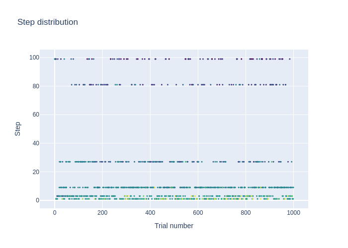

<!--
This is an example of the frontmatters.
All columns must be string.
You can omit quotes when value types are not ambiguous.
For tags, a package placed in
- package/samplers/ must include the tag "sampler"
- package/visualilzation/ must include the tag "visualization"
- package/pruners/ must include the tag "pruner"
respectively.

---
author: Optuna team
title: My Sampler
description: A description for My Sampler.
tags: [sampler, 2nd tag for My Sampler, 3rd tag for My Sampler]
optuna_versions: [3.6.1]
license: "MIT License"
---
-->

## Class or Function Names

- `plot_step_distribution`

## Installation

You should install `plotly` to use this visualization.

```bash
$ pip install plotly
```

## Example

This plot shows how many steps (budget, epoch, iterations, etc.) were consumed before pruning occurred for each trial.

```python
fig = plot_step_distribution(study)
```

See [`example.py`](https://github.com/optuna/optunahub-registry/blob/main/package/visualization/plot_step_distribution/example.py) for a full example.
The following figures are obtained from the analysis of the optimization.

