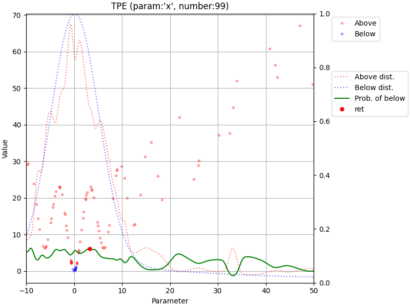

## Abstract

This package is the TPE's Acquisition Visualizer. It provides callback and plot functions.

## APIs

### Class: `TPEAcquisitionVisualizer`

```python
  TPEAcquisitionVisualizer()
```

#### `__call__(self, study: optuna.study.Study, trial: optuna.trial.FrozenTrial) -> None`

Callback function to collect tpe sampler's acquisition information.

Args:

- `study` (`optuna.study.Study`): The study object.
- `trial` (`optuna.trial.FrozenTrial`): The trial object for which the callback is called.

Returns: `None`

#### `plot(self, study: optuna.study.Study, trial_number: int, param_name: str,) -> plt.Figure`

Plots the TPE acquisition for a given trial and parameter.

Args:

- `study` (`optuna.study.Study`): The study object.
- `trial_number` (`int`): The trial number to plot.
- `param_name` (`str`): The parameter name to plot.

Returns: `plt.Figure`: The matplotlib figure containing the plot.

## Example

```python
from __future__ import annotations

import matplotlib.pyplot as plt
import numpy as np
import optuna
import optunahub


module = optunahub.load_module(
    package="visualization/tpe_acquisition_visualizer",
)


def objective(trial: optuna.trial.Trial) -> float:
    x_range = (-10, 50)
    x = trial.suggest_uniform("x", x_range[0], x_range[1])
    return np.abs(x) - 10 * np.cos(1 * x) + 10


seed = 42
tpe_acquition_visualizer = module.TPEAcquisitionVisualizer()

n_startup_trials = 10
study = optuna.create_study(
    sampler=optuna.samplers.TPESampler(
        consider_prior=True,
        prior_weight=1.0,
        consider_magic_clip=True,
        consider_endpoints=False,
        n_startup_trials=n_startup_trials,
        n_ei_candidates=24,
        seed=seed,
        multivariate=False,
        group=False,
        constant_liar=False,
    ),
    direction="minimize",
)

study.optimize(objective, n_trials=100, callbacks=[tpe_acquition_visualizer])

param_name = "x"
for trial in study.trials:
    if trial.number < n_startup_trials:
        continue
    fig = tpe_acquition_visualizer.plot(study, trial.number, param_name)
    fig.savefig(f"{param_name}_{trial.number}.png")
    plt.close(fig)
```



If you want to make an animation gif, please run the following command.

```
convert $(printf "x_%d.png " $(seq 10 99)) tpe_x.gif
```
